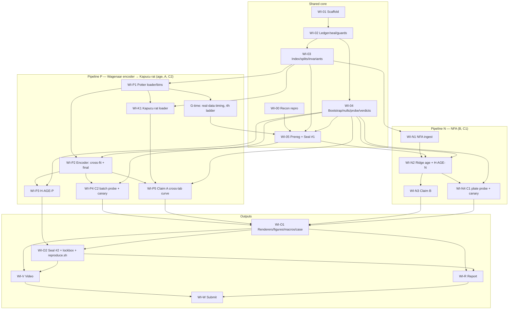

# Implementation Plan: Age-Pretext Encoder for Neural Organ-on-Chip Electrophysiology

**Version 3.** Revised after D3′, D8–D16 and the 09 Oct UK deadline (decision log in §15). Recon is closed. Nothing in this repo
is implemented. Every module is a stub whose docstring states its contract.

- Effort: **S** ≤ 2 h, **M** ≈ 3–4 h, **L** ≈ 8 h. Hour estimates are given per item because
  the budget is now hours-tight.
- **CP** = critical path. **CUT-n** = position in the pre-declared cut order (§9).
- Hard cutoff **09 Oct 2026 23:59 UK**. Budget **≈ 35.75 h**: 25.75 h engineering plus 10 h video and report,
  which is fixed.

---

## 1. Executive summary

**What gets built.** Two pipelines share one evaluation core: the age target, the culture-prep
splits and their invariants, cluster bootstrap, permutation nulls, the relative-rule verdict
engine, the ledger, protocol sealing and the renderers. They do **not** share an input path.

- **Pipeline P (core), Wagenaar/Potter 2006 → Kapucu rat.**
  - Model: a permutation-invariant electrode-set encoder over binned spike trains, trained to
    regress log days-in-vitro on 30 dense rat cultures in 8 dissection batches. This is the
    **age-pretext encoder**.
  - It is then frozen and transferred to a **different lab and platform**: Kapucu 2022 rat
    cultures (Axion, 64 electrodes per well, 3 independent preps).
  - Hosts Claim A and the encoder half of Claim C.
- **Pipeline N (core), EPA Network Formation Assay (NFA) 2018.**
  - A minimal prep-bagged ridge age model on the 17 published well-level features.
  - Hosts Claim B, the age-residual perturbation readout, at 18-prep rigour.
  - Hosts the artefact-only half of Claim C: a within-prep plate probe.
- **Kapucu hPSC** remains stretch S-1 and is non-inferential. Its whole age series is one
  prep (§2.2).

**What gets claimed.** The relative rule (D5) applies throughout.
- **A (representation: cross-lab few-shot transfer).**
  - Setup: the Wagenaar-trained encoder, frozen, plus a ridge head fit on k labelled Kapucu rat
    wells, forecasts each well's network-burst rate 7 days ahead in a **held-out Kapucu prep**.
  - Reported: the full curve at k = 1, 2, 4, 8, 16, all, against four baselines at every k.
  - Primary comparison (pre-declared): ours at k = 4 vs the best baseline at k = all (24 wells).
  - The inference rule for 3 preps is decision D17 (§6).
- **B (readout).** In NFA, out-of-fold age deviation of chronically exposed wells beats the
  best 1-D baseline readout: the mean-firing-rate + burst-rate age residual, or the best single
  raw feature. Development is on ToxCast (12 preps), confirmed once on the sealed NTP lockbox
  (6 preps).
- **C (credibility), two primary results:**
  - **C1, artefact-only (NFA):** plate identity within a culture prep is not decodable from the
    Claim B readout. The cells, prep and plating day are the same; only the plate differs. A
    canary must be caught at the pre-declared power.
  - **C2, encoder (Wagenaar):** dissection-batch identity is not decodable from the encoder,
    with its own canary.
  - **Claim C holds iff C1 holds.** C2 qualifies the wording (§5.7).

**Single biggest risk: inference on Claim A rests on 3 preps.**
- Cross-lab transfer is the stronger scientific test. But a prep-level cluster bootstrap over
  3 clusters is degenerate: there are only 10 distinct resamples.
- So the D5 rule cannot be applied as written. D17 proposes a conservative substitute: ours
  must win in **every** held-out prep.
- Whatever you choose, A's evidence is thinner than B's (18 preps) or C1's.

**Second risk:** C2 is irreducibly confounded with biology (Wagenaar's culture-specific
repertoires). This is why C1 is primary.

**Third risk:** B may refute against the firing + burst residual. This is pre-declared, and §6b
specifies the submission for every outcome.

**Deadline: 09 Oct 2026 23:59 UK (22:59 UTC).** Schedule in §8. Terminology: "age-pretext
encoder" only.

## 2. Structure by dataset role, and what the evidence did to Claim A

### 2.1 Roles (your D1, adopted; Claim A target updated by §2.3)

| Corpus | Role | Input path | Claims | Independent units |
|---|---|---|---|---|
| Wagenaar/Potter 2006 (dense) | Age-pretext encoder corpus | spike times → 200 ms bins → set encoder | age prerequisite, C2 | 8 batches (prep), 30 cultures |
| Kapucu 2022 rat (`190617`, `250417`, `31017`) | Cross-lab transfer target | spike CSVs → same bins → **frozen** encoder | A | 3 preps, 36 wells |
| EPA NFA 2018 | Readout corpus | 17 features → per-fold transforms → ridge | B, C1 | 18 preps (TC 12 dev, NTP 6 lockbox) |
| Kapucu 2022 hPSC | Human demonstration | as Kapucu rat | stretch S-1 | 1 prep with a series (§2.2) |

**Shared code:** `invariants`, `data/index`, `data/splits`, `data/windows`, `eval/age`,
`eval/bootstrap`, `eval/nulls`, `eval/verdicts`, `eval/identity_probe`, `validation/*`, `viz/*`,
`report_numbers`.
**Not shared:** loaders, NFA transforms, models, and the claim-specific evaluators.

### 2.2 Kapucu was verified today: usable data, unusable for a culture-prep claim

GIN folder listing plus one file downloaded (`hPSC_20517_MEA1_DIV28_spikes.csv`: 9,369,904 bytes,
601,688 rows, header `Channel,Time`, channel `<well>_<electrode>`):

| Species | Prep (culture date) | Plates | DIVs |
|---|---|---|---|
| hPSC | `20517` | MEA1 + MEA2 (6 wells each, 64 electrodes) | 19 timepoints, DIV 3–66 |
| hPSC | `171017` | MEA4 | DIV 21, 24, 28 only |
| hPSC | `21018` | MEA5 | DIV 70, 73, 77 only |
| rat | `190617` | MEA1 | DIV 2–35 (10 timepoints) |
| rat | `250417` / `31017` | MEA3 / MEA4 | 3 timepoints each, DIV 21–31 |

Notes:
- `hPSC_MEA1_PCA` is a DIV 21–28 subset of the same `20517` plate, not a new prep.
- Pharmacology plates (`*_MEA2/3_Pharmacology`) are acute, single-timepoint.

Consequences for D3 (few-shot hPSC age prediction) under your D4 (culture prep is the unit):
- **The entire hPSC age series is one prep.** Splitting by prep forces the labelled pool to be
  prep `20517` and the test set to be preps `171017` + `21018`.
- In that test set **each prep occupies a single 7-day age window** (≈ DIV 24 vs ≈ DIV 74).
  Age is perfectly confounded with prep identity. A model that "predicts age" there could be
  detecting prep differences.
- There are two test clusters, so a cluster bootstrap is impossible and the D5 rule cannot be
  evaluated.
- Splitting MEA1 vs MEA2 instead is a split *within* one prep, which is exactly what D4 says
  understates variance.

**Outcome (v3):** hPSC remains stretch S-1, a non-inferential demonstration. The v2 fallback to
Wagenaar-internal forecasting is **superseded** by the rat answer in §2.3.

---

### 2.3 Rat prep answer (recon closes here)

Listing of every Kapucu rat folder, 5 Oct (`Data/Rat_MEA1`, `Data/Rat_MEA2_Pharmacology/*`,
`Data/PCA/Rat_MEA{1,3,4}_PCA`). Filenames only. No spike file was opened in this pass.

| Prep (culture-date token) | Plate | Timepoints (DIV) | n |
|---|---|---|---|
| `190617` | Rat_MEA1 (12-well, 64 electrodes per well) | 2, 7, 10, 14, 17, 21, 24, 28, 31, 35 | 10 |
| `50618` | Rat_MEA2 (48-well, 16 electrodes per well, pharmacology) | 22 only (baseline / drug / TTX sessions) | 1 |
| `250417` | Rat_MEA3 (12-well) | 21, 24, 28 | 3 |
| `31017` | Rat_MEA4 (12-well) | 24, 28, 31 | 3 |

`Rat_MEA1_PCA` is a DIV 21–28 subset of the same `190617` plate, so it is not a separate prep.

- **≥ 3 preps with overlapping age windows? Yes, exactly 3.** Preps `190617`, `250417` and
  `31017` all contain DIV 24 and DIV 28.
- `50618` is a fourth prep at a single timepoint (DIV 22). It has no within-well 7-day pair
  and is unusable for Claim A.
- **Per your rule, Claim A is cross-lab transfer, Wagenaar → Kapucu rat.** Wagenaar-internal
  forecasting is **not** adopted as Claim A, and it is not run in the MVR.
- Seven-day forecasting pairs per prep: `190617` 7→14 … 28→35 (7 per well); `250417`
  21→28 (1 per well); `31017` 24→31 (1 per well).
- **Recon is now closed.** No further dataset discovery. The listing is logged as ledger row 2.

## 3. Evidence base

The NFA and Potter facts are as in v1. The checks run today add the Kapucu layout above and the
Potter batch structure below. Everything below was observed directly, not assumed.

- **NFA:**
  - TC: 11,512 rows, 12 preps, 66 plates, 363 control wells.
  - NTP: 5,712 rows, 6 preps, 33 plates, 180 control wells.
  - DIV is 5/7/9/12 only. 17 endpoints plus MI.
  - Controls sit in column 2. No spike lists. Viability (AB/LDH) per compound-dose.
  - Control medians, DIV 5 → 12: mean firing rate 0.35 → 1.85 Hz; burst rate 0.12 → 4.6/min.
- **Potter:**
  - Dense: 30 cultures, 527 recordings, DIV 3–39, `.spk.txt.bz2` (`time_s channel`, about
    690 KB per file).
  - Cultures per batch: b1:5, b2:6, b3:6, b4:2, b5:3, b6:3, b7:2, b8:3.
  - Sparse (10) and small (12) cultures exist only in batches 5–7, so **density is confounded
    with batch**.
  - → MVR uses dense only. Sparse and small are stretch.
- **Kapucu:** §2.2 (hPSC) and §2.3 (rat). CC BY 4.0. Individual CSVs download over HTTPS from
  `gin.g-node.org/.../raw/master/...`, about 9 MB per plate per DIV.
  - Claim A needs the rat CSVs for preps `190617` (10 DIVs), `250417` (3) and `31017` (3):
    16 files, about 150 MB.

The A13 disclosure (pre-recon descriptive statistics) is extended to cover today's checks: Potter
index-level counts, Kapucu folder listing, and one hPSC file's size, header and line count. No
activity statistic was computed on Kapucu or Potter. **The disclosure is the genesis row of
`ledger/results.jsonl`** (per D2).

---

## 4. WI-00: Reconnaissance (CP, S, 1 h; discovery CLOSED)

Discovery is closed (§2.3). WI-00 now only makes the known answers reproducible:
- sha256 manifests for NFA, Potter dense and the Kapucu rat CSVs;
- verbatim licence texts;
- a scripted re-derivation of §2.3 and §3 counts;
- seven-day pair counts per Kapucu rat well and Potter culture.

New datasets are out of scope.

**Kill-gate (end of WI-00):**

| Gate | Trigger | Consequence |
|---|---|---|
| **K1** encoder corpus | Fewer than 8 Potter dense batches parse with DIV, or any batch has fewer than 2 cultures with ≥ 5 DIVs | Go to Fallback F-B (artefact audit: C1 + NFA B intact) |
| **K2** Claim B / C1 | NFA unavailable, unlicensable, or dosing not chronic | Drop B. C1 still runs, because it needs only the NFA controls. |
| **K3** Claim A | Fewer than 8 wells per Kapucu rat prep have spikes at both ends of their overlap-window pair | A switches to its pre-declared alternative target, log mean firing rate at t′. Same design. |

**G-time gate (D8: run immediately after WI-P1, before Seal #1, on REAL data):**
1. Time one forward + backward pass on one Potter culture's full tensor set (all of its
   recordings, 120 s windows, real electrode count) on the build machine, with a random-init
   encoder. This is not a result.
2. Extrapolate total training: 4-fold cross-fit × M + final × M + 10 canary retrains + the
   Kapucu BL-A2 fits.
3. **If the projection exceeds 4 h of wall-clock, shrink immediately.** Apply this pre-declared
   ladder in order until the projection is ≤ 4 h:
   1. bins 200 → 400 ms;
   2. channels [16, 32, 32] → [8, 16, 16];
   3. epochs 40 → 25;
   4. M 3 → 1.
4. Each step is logged as an infrastructure ledger row before Seal #1.
5. This container measures 4 cores and 15 GB RAM. If you build elsewhere, the gate measures
   your machine.

**Fallback F-B (if K1 fires): "Do MEA representations encode the lab?"** A protocol-only
submission built on C1 (NFA plate probe + canary) and the shared core. It matches the
all-claims-fall row of §6b.

## 5. Design decisions

### 5.1 Input representation
- **P: binned spike counts.** 200 ms bins, 120 s windows (600 bins), per electrode, plus a
  population-rate channel.
  - Raw voltage is rejected: it is unavailable for Potter and carries amplifier-noise
    fingerprints, which works against Claim C.
  - Event-based input is rejected: it is over-built for the scale.
  - 200 ms resolves network bursts, typically 100 ms to 1 s, and inter-burst intervals of
    seconds. 120 s windows hold several bursts from roughly DIV 7 onward.
  - Fallback: 400 ms bins (G-time).
- **N: the 17 NFA endpoints plus MI, with undefined-indicators.** This is the only form in
  which NFA exists. The v1 transforms are kept (log1p, logit on percentages, fractions of
  electrodes, train-fold median imputation and standardisation).

### 5.2 Geometry
- Potter is MCS, 59 recording electrodes per culture. Kapucu is Axion: 64 electrodes per well
  on 12-well plates, 16 per well on 48-well plates.
- The encoder treats electrodes as an unordered set: shared per-electrode CNN, then attention
  pooling (one seed) concatenated with mean and max pooling. Invariance to electrode
  permutation is unit-tested.
- Training augmentation subsamples each window to a random 16–59 electrodes, so the encoder is
  exercised on Axion-like counts.
- Electrode coordinates are not an input, because they would let the model fingerprint hardware.
- Noisy electrodes listed by the source are dropped, not zero-filled.

### 5.3 Architecture
- **P encoder:**
  - Per-electrode 1-D CNN: 3 layers, channels 16 → 32 → 32, kernel 5, dilations 1/4/16,
    receptive field about 17 s.
  - Then set pooling, z ∈ ℝ³², and a linear age head. About 12k parameters.
  - Recording prediction is the mean over windows. Training samples 2 windows per recording
    per epoch, 40 epochs, AdamW.
  - Compute estimate: about 1 GFLOP per window-step, about 1,000 windows per epoch, about
    10 s per epoch, so about 7 min per model on CPU.
  - The smallest thing that can see burst structure over electrodes. Nothing larger is
    justified at 30 cultures.
- **N model: ridge on 25 transformed inputs.** Only an age axis is needed, no representation
  claim. Ridge is the smallest adequate model and keeps B about the *readout*, not the model.
- **Uncertainty:** cluster-bagged ensembles, with members trained on bootstrap resamples of
  training **preps**.
  - P: M = 3 (CPU budget).
  - N: M = 5 (ridge is free).
  - Group-level intervals always come from the prep-level cluster bootstrap (B = 4,000).

### 5.4 Age target and species
- Target is **log(DIV)** for both pipelines, via shared code (`eval/age.py`), with one
  species-specific head per species. No shared age scale across species.
- MVR is rat-only, in both corpora. The species clock arises only in S-1 (hPSC). There the
  rat-trained axis is evaluated by within-plate rank correlation and isotonic recalibration,
  never by regressing days.
- Potter spans the plateau (beyond about DIV 25). Age error is reported per DIV bin
  (3–9, 10–16, 17–23, 24–39), so plateau unidentifiability is visible, not averaged away.

### 5.5 Splitting invariants and the clustering unit (D4)

**Prep is the unit everywhere:**
- Potter: dissection batch (8).
- Kapucu rat: culture-date token (3 usable).
- NFA: culture date (18).

Culture- and plate-level intervals are sensitivity analyses, never headline. INVARIANT-1/2/3
and their enforcement are as in v1: typed `RecordingIndex`, `SplitManifest` as the only split
mechanism, `assert_group_disjoint` on every constructor, the leakage test suite, and seal
refusal.

**Splits:**
- **Potter:** 4-fold cross-fit, 2 batches per fold, for H-AGE-P. One **final encoder** is
  trained on all 8 batches and is the only encoder Claim A and C2 use.
- **Kapucu rat:** leave-one-prep-out, 3 folds, for Claim A. The encoder never sees Kapucu.
- **NFA:** TC dev with 6-fold cross-fit; NTP lockbox (D2).
- **No tuning anywhere (D2b):** every hyperparameter is fixed at Seal #1. The only exception
  is the G-time shrink ladder, applied before the seal and logged.

**Sanctioned identity-probe exceptions** (`SplitPurpose.IDENTITY_PROBE`, reachable only from
`eval/identity_probe.py`, recorded in the ledger):
1. C2: cultures split within batch (Potter).
2. C1: wells split within plate (NFA controls).

Both are needed because an identity probe must see each identity on both sides.

### 5.6 Claim A task: cross-lab few-shot transfer, Wagenaar → Kapucu rat (per §2.3)

**Setup:**
- **Encoder:** the final Wagenaar encoder (all 8 batches), frozen. It is never trained or tuned
  on Kapucu.
- **Folds:** leave-one-prep-out over `190617`, `250417` and `31017`. Prep `50618` is excluded:
  single timepoint, no pairs.
- **Target:** log1p network-burst rate of the same well at DIV t′, where t′ − t ∈ [6, 8].
  - The detector is identical to Potter's (§5.8). Its thresholds are fractions of active
    electrodes, so it transfers from 59 to 64 electrodes without re-tuning (A16).
  - Alternative target if K3 fires: log mean firing rate at t′.
- **Labelled unit = well.** The pool is the wells of the 2 training preps (24 wells).
  - k ∈ {**1, 2, 4, 8, 16**, all = 24}. **The full curve is required**, and it is demo shot 2.
  - 30 draws per k. BL-A2 gets 5 random-init seeds per draw.
- **Training pairs:** every pair of each labelled well, any DIV.
- **Evaluation pairs:** the held-out prep's own 7-day pairs with t ∈ {21, 24}. These are per-prep,
  not shared: 190617 has 21→28 and 24→31, 250417 has 21→28 only, 31017 has 24→31 only. Folds
  therefore differ in age transition; the report must flag this. No prep is dropped to force a
  common pair. Pre-declared.

**Methods** (every method receives DIV t as an input):
- **Ours:** [frozen z, DIV] → ridge.
- **BL-A0:** DIV only.
- **BL-A1:** [log mean firing rate, log burst rate, DIV] → ridge (hand-crafted state).
- **BL-A2:** same architecture from random init, trained on the k wells (40 epochs). Kapucu data
  is small, so this is cheap.
- **BL-A3:** [frozen random-init z, DIV] → ridge.

**Metric and comparison:** MAE, lower is better. Primary comparison: ours at k = 4 vs the best
baseline at k = all.

**Inference (D17, open).** There are 3 prep clusters, so a prep-level bootstrap is degenerate.
- **Recommended: worst-fold rule.** A survives iff, **in each of the 3 held-out preps**, the
  well-level bootstrap upper bound of MAE(ours, k = 4) is below the best baseline's point MAE
  at k = all in that prep. A well-level interval understates prep variance; requiring 3 of 3
  wins compensates.
- Alternatives: (b) pool 36 wells as the cluster unit, which breaks D4; (c) make
  Wagenaar-internal forecasting (8 batches) the gating test and report cross-lab without
  gating.

**Reported, not gating:** zero-shot age error of the Wagenaar rat age head on Kapucu rat
recordings, per prep. This is cross-lab age calibration at no extra cost.

### 5.7 Claim C design: two primary results (D13 promoted)

**C1, artefact-only (NFA). This is the measurement that matters.**
- **Representation probed:** the Claim B readout itself. For each control well, the out-of-fold
  Δ trajectory over DIV 5/7/9/12 (TC from cross-fit; NTP from the final TC model under
  Seal #2).
- **Reported, not gating:** the same probe on the 25 transformed input features. If the inputs
  carry plate identity but Δ does not, the readout is filtering it out.
- **Probe:**
  - Within each prep, controls only, labels = plate.
  - Multinomial logistic regression (inner-CV), leave-one-well-out within plate (exception 2).
  - Statistic: excess balanced accuracy pooled over all 18 preps.
  - p-value: 1,000 within-prep permutations of plate labels at well level.
- **Canary:**
  - Per plate, add an offset to every transformed input feature for all wells of that plate,
    drawn from N(0, (0.5·σ_w)²). σ_w is the within-plate between-control-well SD of that
    feature, estimated on TC train preps.
  - Then refit the ridge, recompute Δ and re-probe.
  - 20 seeds (ridge refits are cheap).
- **What C1 certifies:** the readout pipeline (features → ridge → Δ). It does **not** certify
  the Wagenaar encoder. The report states this.

**C2, encoder (Wagenaar).**
- **Representation:** the final encoder's z, probed within each of the 4 DIV bins.
- **Probe:** labels = batch; cultures split within batch (exception 1); 1,000 culture-level
  permutations.
- **Canary:** a batch-specific "noisy electrode" artefact. In each batch, a seeded random 10% of
  electrodes get extra Poisson spikes at the corpus median per-electrode rate. It is injected
  into training data and the encoder is retrained, over 10 seeds.
- The out-of-fold secondary probe is dropped (trim).
- **Confound:** irreducibly confounded with culture biology (§1).

**Verdict per component:**
- **SUPPORTS** iff canary power ≥ 0.8 **and** real-identity p ≥ 0.05.
- **REFUTES** iff power ≥ 0.8 and p < 0.05.
- **INCONCLUSIVE** iff power < 0.8.

**Claim-level aggregation** (my resolution, D18; object if wrong):
- **Claim C holds iff C1 SUPPORTS.** C2 cannot falsify an artefact claim, because its target is
  confounded with biology. It can only strengthen one. C2 sets the wording:
  - C2 SUPPORTS → "…and the encoder carries no decodable batch identity".
  - C2 REFUTES → "…batch identity is decodable from the encoder; on this corpus, biology and
    artefact cannot be separated".
  - C2 INCONCLUSIVE → "…encoder credibility underpowered".
- **Dependency:** if C1 REFUTES (plate identity leaks into Δ), Claim B's numbers are reported
  but **B falls**, because the readout is not attributable to biology. If C1 is INCONCLUSIVE,
  B stands with the caveat "credibility untested at adequate power".

### 5.8 Hand-crafted features for Potter baselines
- Mean firing rate: spikes / (active electrodes × duration).
- Network-burst rate: population spike count in 100 ms bins exceeding the larger of (a) 4 ×
  the recording's median bin count and (b) spikes on ≥ 25% of active electrodes. Consecutive
  supra-threshold bins merge into one burst.
- The rule is fixed in `configs/features/potter_handcrafted.yaml` before Seal #1 and never
  tuned on outcomes. These numbers define a measurement, not a claim threshold.

### 5.9 Claim B design (D5)
- Δ = ŷ − log DIV, out-of-fold (6-fold by prep on TC; final model on all TC → NTP).
- Within-plate effect E(c, d, t) = mean Δ(treated) − mean Δ(same-plate controls).
  Δ-AUC = area under E over DIV 5–12.
- **Non-cytotoxic is defined relative to controls, with no absolute cut-off:** compound-dose
  mean AB ≥ the 5th percentile of control-well AB in the same subset.
- **Detection:** threshold at the 5% false-positive rate of a control-vs-control
  pseudo-treatment null. Detection rate = fraction of compounds whose Δ-AUC at the highest
  non-cytotoxic dose exceeds it.
- **Gating comparators** are the 1-D readouts, all thresholded identically:
  - BL-B1: age residual from a mean-firing-rate + burst-rate ridge age model. Your
    pre-declared kill baseline.
  - BL-B2: best single raw-feature deviation, chosen on dev.
- **BL-B3 Mahalanobis (17-D omnibus) is reported and is not gating (D14, adopted).** An
  omnibus anomaly detector beats any 1-D projection on detection rate by construction.
- **Calibration gate:** held-out control mean Δ has a CI containing 0. This is a null check,
  not an absolute threshold.
- **Sensitivity analyses:** lowest-dose wells as the reference (column-2 position confound);
  plate-clustered intervals; cytotoxic doses reported separately. Dose-response was dropped
  (§7 trims).
- **Credibility dependency:** B's claim status requires that H-C1 does not REFUTE (§5.7).

---

## 6. Validation specification (binding text in `PREREGISTRATION.md`)

**Relative rule (D5).** A claim survives only if its cluster-bootstrap bound in the favourable
direction beats the **point estimate** of the best pre-declared baseline. No absolute claim
thresholds. Canary design parameters are pre-declared, not claim thresholds.

| Hypothesis | Metric | Survives iff | Gating baselines |
|---|---|---|---|
| H-AGE-P (Wagenaar) | out-of-fold MAE log-DIV, held-out batches | UB < min baseline point | BL-0, BL-1 |
| H-AGE-N (NFA) | same, held-out TC preps, controls | UB < min baseline point | BL-0, BL-1 |
| H-A (Kapucu rat) | forecasting MAE, overlap-window pairs | **D17:** default is UB_well(ours, k = 4) < min baseline point (k = all) **in each of 3 held-out preps** | BL-A0, BL-A1, BL-A2, BL-A3 |
| H-B (NFA) | detection rate at 5% control-null false-positive rate | calibration CI contains 0 **and** LB > max baseline point **and** H-C1 is not REFUTES | BL-B1, BL-B2 (BL-B3 reported, D14) |
| H-C1 (NFA plate within prep) | canary power; real-plate p | power ≥ 0.8 and p ≥ 0.05 | n/a |
| H-C2 (Wagenaar batch) | canary power; real-batch p | power ≥ 0.8 and p ≥ 0.05 (sets wording only) | n/a |

**Claim status for §6b:**
- A holds iff H-A SUPPORTS.
- B holds iff H-B SUPPORTS.
- C holds iff H-C1 SUPPORTS.
- **Falls** = REFUTES or INCONCLUSIVE. The verdict label is reported exactly as computed.

**Prerequisite failures:**
- H-AGE-P failing is attached to A and C2.
- H-AGE-N failing switches B to the BL-1 age model, labelled as such.

**Mechanics:** Seal #1 before any training. Per-run protocol hash; refusal on a dirty tree.
Seal #2 before the NTP lockbox. Hash-chained ledger: row 1 is the A13 disclosure, row 2 is
recon closure. Verdicts come from `eval/verdicts.py`, and the §6b case number is computed from
them.

## 6b. Refutation contingency (D16): the submission for every outcome

**Fixed framing for all outcomes.** The contribution is a **falsification-first evaluation
protocol for neural MEA representations**: preregistration, a relative decision rule,
culture-prep clustering, a canary-calibrated identity probe, sealed runs and an append-only
ledger. Claims A, B and C are its three **applications** to an age-pretext encoder. The title,
the report spine, the protocol sections and the video structure are identical in every case.
Only the verdict-dependent text changes, and it is pre-written (report outline §R-mechanics).

**Title (all cases):** *"Falsifiable by construction: a pre-registered evaluation protocol for
neural MEA representations, applied to an age-pretext encoder."*

**Case number.** `report_numbers.py` computes the case from the verdicts:
1. A, B and C all hold.
2. A falls.
3. B falls.
4. C falls.
5. A and B fall.
6. A and C fall.
7. B and C fall.
8. All three fall.

**Collapse rule:** if C falls because **C1 REFUTES**, B also falls (§5.7 dependency). Case 4 is
then case 7, and case 6 is then case 8. Cases 4 and 6 exist only when C1 is INCONCLUSIVE.

**Figures** (all generated in every case; refutations are results):
- F1 corpora and roles
- F2 protocol workflow
- F3 ledger timeline with verdict rows
- F4 age calibration (Wagenaar by DIV bin, NFA)
- F5 Claim C panel: C1 plate probe + canary power; C2 batch probe + canary power
- F6 Claim A full few-shot curve, per held-out prep
- F7 Claim B trajectories
- F8 Claim B detection vs BL-B1, BL-B2 (and BL-B3)

| Case | Headline claim (abstract sentence 1) | Report spine (§5 order and emphasis) | Main text | Appendix |
|---|---|---|---|---|
| **1** all hold | "An age-pretext encoder trained on one lab's rat cultures transfers few-shot to another lab's; its age residual detects chronic chemical exposure beyond firing-rate readouts; and the readout carries no plate artefact. Each result was pre-registered and decided against its best baseline." | Protocol → C → A → B → sponsor precondition | F1–F8 | — |
| **2** A falls | "The age-residual readout detects chronic exposure beyond firing-rate readouts and is certified free of plate artefact by a power-calibrated within-prep probe. The pre-registered cross-lab transfer claim was refuted [or inconclusive], and the protocol shows by how much." | Protocol → C → B → A (as "what the protocol rejected") | F1, F2, F4, F5, F7, F8, F6, F3 | — |
| **3** B falls | "A spike-train age-pretext encoder transfers few-shot across labs and platforms, with no decodable plate artefact in the readout pipeline. On summary features, the age residual did not beat a firing-rate + burst-rate readout (pre-registered refutation)." | Protocol → C → A → B (as a negative replication) | F1, F2, F4, F5, F6, F8, F3 | F7 |
| **4** C falls (C1 INCONCLUSIVE only) | "Cross-lab transfer and the age-residual readout both beat their baselines. The protocol's own positive control shows that plate-artefact absence **could not be established** at this sample size, so both results are reported as uncertified." | Protocol → C (power analysis: what sample size would certify) → A → B with caveats | F1, F2, F5, F4, F6, F7, F8, F3 | — |
| **5** A, B fall | "Applied to age-as-pretext on public MEA data, the protocol refuted [or left inconclusive] both the transfer and the readout claims against hand-crafted baselines, while certifying the readout pipeline free of plate artefact. The certified credibility test is reusable on any pooled neural data asset." | Protocol → C (as the deliverable) → "what the protocol rejected": A, B → sponsor precondition | F1, F2, F3, F5, F6, F8, F4 | F7 |
| **6** A, C fall (C1 INCONCLUSIVE only) | "Only the age-residual readout beat its baseline, and the protocol could not certify it free of plate artefact. We report it as an uncertified lead, not a finding." | Protocol → C (underpowered) → B (uncertified) → A (rejected) | F1, F2, F3, F5, F8, F6, F4 | F7 |
| **7** B, C fall | "Cross-lab few-shot transfer of the age-pretext encoder held. The readout claim fell: [C1 REFUTES: the protocol detected plate identity in the readout, so the readout result is not attributable to biology] / [C1 INCONCLUSIVE: it did not beat firing-rate readouts and could not be certified]." | Protocol → C (what the probe caught) → A → B (rejected) | F1, F2, F5, F3, F6, F4, F8 | F7 |
| **8** all fall | "A falsification-first protocol applied to age-as-pretext rejected all three pre-registered claims against hand-crafted baselines and positive controls. We release the protocol, ledger and canary-calibrated identity probe as the contribution: a test any neural representation can be held to before it is trusted." | Protocol (expanded: design rationale) → "what it rejected and why": C, A, B → sponsor precondition (an acceptance test for pooled data assets) | F1, F2, F3, F5, F6, F8, F4 | F7 |

**Video in every case:**
- The same six-segment structure (STORYBOARD). The full few-shot curve (shot 2) is always shown.
- Verdict badges and the closing headline line are read from the ledger and case number.
- No re-editing beyond swapping the closing card text. The 8 variants are pre-written in
  `demo/STORYBOARD.md`.

**What never changes:** title, §1–§4 and §6–§8 of the report (protocol, data, methods,
limitations, reproducibility), and the sponsor-precondition argument. When claims fall, the
argument gets stronger, not weaker: a protocol that rejects claims is the one worth adopting.

## 7. Work items (dependency-ordered, 25.75 h engineering + 10 h fixed)

The full table is in `workitems.yaml`. "Done when" is the acceptance criterion.

**Pre-applied trims** (to absorb the new Kapucu loader and the promoted C1):
- Wagenaar-internal forecasting replaced by cross-lab Claim A.
- C2's out-of-fold secondary probe dropped.
- Claim B dose-response dropped.
- Shots rendered as frame sequences, with the progressive curve built from recorded events.
- WI-00 reduced to 1 h.

### Shared core (6.5 h)

| ID | Item | h | Deps | Done when |
|---|---|---|---|---|
| **WI-00** | Recon reproducibility (manifests, licences, scripted counts, K1–K3) | 1.0 | — | §2.3/§3 counts re-derived by script. Gates evaluated. |
| **WI-01** | Scaffold, env, CLI, CI | 0.5 | — | Fresh-container install works. |
| **WI-02** | Ledger, seal, guards | 1.5 | WI-01 | Tamper and dirty-tree tests pass. Rows 1–2 verify. |
| **WI-03** | Index, splits, invariants, both identity-probe exceptions | 1.5 | WI-02 | Invariant tests pass. `splits/{potter_cv4,kapucu_rat_lopo,nfa_dev_cv6,nfa_lockbox}.json` are deterministic. |
| **WI-04** | Cluster bootstrap, permutation nulls, shared identity probe, verdict engine (relative rule, worst-fold rule, C rules, case number) | 1.5 | WI-02 | Coverage simulation passes. Verdict and case tables reproduce §6 and §6b on hand-built inputs. |
| **WI-05** | Prereg final + Seal #1 | 0.5 | WI-00, WI-03, WI-04, G-time | No placeholders. Seal created. |

### Pipeline P: Wagenaar → Kapucu rat (11.75 h)

| ID | Item | h | Deps | Done when |
|---|---|---|---|---|
| **WI-P1** | Potter loader, binning, hand-crafted features | 2.0 | WI-03 | 527 recordings indexed. Bin-count invariant passes. Burst detector unit-tested. |
| **G-time** | Real-data timing + 4 h projection + shrink ladder (§4) | 0.25 | WI-P1 | Projection ≤ 4 h, logged. |
| **WI-P2** | Set encoder, age training, 4-fold cross-fit, final encoder | 3.0 (+ background CPU) | WI-P1, WI-05 | Invariance test passes. Deterministic. Out-of-fold predictions plus final encoder saved. |
| **WI-P3** | H-AGE-P | 0.5 | WI-P2, WI-04 | Verdict and per-bin errors ledgered. |
| **WI-P4** | C2: batch probe + 10 canary retrains | 2.0 (+ background CPU) | WI-P2, WI-04 | Verdict ledgered. Shot-3 inputs exist. |
| **WI-K1** | Kapucu rat loader (3 preps), binning via shared windows, pairs | 1.0 | WI-03, WI-P1 | Verified prep table asserted. Pair counts match WI-00. |
| **WI-P5** | Claim A cross-lab few-shot engine, full curve, BL-A0–A3, worst-fold verdict, zero-shot age (reported) | 3.0 | WI-P2, WI-K1, WI-04 | Event stream for shot 2. Verdict ledgered. |

### Pipeline N: NFA (5.5 h)

| ID | Item | h | Deps | Done when |
|---|---|---|---|---|
| **WI-N1** | NFA ingestion + transforms | 1.0 | WI-03 | Row counts match. MI join lossless. |
| **WI-N2** | Ridge age model, 6-fold cross-fit, H-AGE-N | 0.5 | WI-N1, WI-04, WI-05 | Controls-only training asserted. Verdict ledgered. |
| **WI-N3** | Claim B readout, BL-B1/B2 (+B3 reported), lowest-dose and plate-clustered sensitivity | 2.0 | WI-N2 | Calibration reported first. Shot-1 trajectories exported. |
| **WI-N4** | C1: within-prep plate probe on Δ + 20 canary seeds (+ input-feature probe, reported) | 2.0 | WI-N2, WI-04 | Verdict ledgered. Shot-3 left panel inputs exist. |

### Outputs (2 h engineering + 10 h fixed)

| ID | Item | h | Deps | Done when |
|---|---|---|---|---|
| **WI-O1** | Frame renderers for shots 1–3, figure registry F1–F8, number and verdict macros, case number | 1.0 | WI-P4, WI-P5, WI-N3, WI-N4 | Byte-identical regeneration. All 8 caption variants render. |
| **WI-O2** | Seal #2, NTP lockbox (B + C1 confirmatory), `reproduce.sh` | 1.0 | WI-P3, WI-O1 | One lockbox opening ledgered. Clean-container reproduction passes overnight. |
| **WI-V** | Video ≤ 5:00 | 4.0 fixed | WI-O1, WI-O2 | Shots 1–3 present; the full curve is shown; closing card from the case number. |
| **WI-R** | Report (protocol-first outline, verdict-conditional text) | 5.0 fixed | WI-O1, WI-O2 | 15–20 pp. Case-specific text selected by macro, not edited by hand. |
| **WI-W** | README, Kaggle writeup, packaging | 1.0 fixed | WI-V, WI-R | Submitted before 09 Oct 23:59 UK. |

**Total:** 6.5 + 11.75 + 5.5 + 2.0 = **25.75 h** engineering, plus 10 h fixed = **35.75 h**.

### Stretch (droppable, priority S-1 → S-7, per D12)

| ID | Item | h |
|---|---|---|
| S-1 | Kapucu hPSC human demonstration (non-inferential) | 1.5 (loader exists via WI-K1) |
| S-2 | Wagenaar-internal forecasting (8-batch inferential companion to A; also D17 option c) | 1.5 |
| S-3 | NFA cytotoxicity prediction | 2.0 |
| S-4 | Canary at 3 magnitudes (C1 and C2) | 0.5 |
| S-5 | Potter sparse/small cultures in pretext | 1.5 |
| S-6 | Grouped conformal intervals | 1.0 |
| S-7 | Docker image | 1.0 |

## 8. Dependency graph and schedule

**Critical path:** WI-01 → WI-02 → WI-03 → WI-P1 → G-time → WI-05 → WI-P2 → WI-P5 → WI-O1 →
WI-O2 → WI-V/WI-R → WI-W. Pipeline N and WI-K1 fill the CPU-bound gaps.

**Schedule. Hard cutoff 09 Oct 23:59 UK (22:59 UTC); target submission 09 Oct 20:00 UK.**

| Day (UK) | Work | Hours | Overnight CPU |
|---|---|---|---|
| Mon 5 Oct | WI-00, WI-01, WI-02, WI-03, WI-04 | 6.0 | — |
| Tue 6 Oct | WI-P1, G-time, WI-05 (**Seal #1**), WI-P2, WI-K1 | 6.75 | P2 cross-fit + final encoder |
| Wed 7 Oct | WI-P3, WI-P4, WI-N1, WI-N2, WI-N3, report §1–4 draft (from the fixed 10 h) | 7.0 | C2 canary ×10 |
| Thu 8 Oct | WI-P5, WI-N4, WI-O1, WI-O2 (**Seal #2**, lockbox), video asset capture (fixed) | 7.5 | clean-container `reproduce.sh` |
| Fri 9 Oct | Video 3.5 h, report 4.0 h, writeup and submit 1.0 h (fixed) | 8.5 | — |

**Total:** 35.75 h. The fixed 10 h is split as report 1.0 (Wed) + 4.0 (Fri), video 0.5 (Thu)
+ 3.5 (Fri), writeup 1.0 (Fri). That leaves **about 4 h of buffer before the cutoff, and that
buffer is the only slack.**

**Checkpoints:**
- **G-sched-1, Wed 7 Oct 22:00 UK:** if more than 2 h behind, apply §9 cuts from the top until
  back on schedule. Ledger it.
- **G-sched-2, Thu 8 Oct 18:00 UK:** if Seal #2 is not reachable by 23:00, apply cuts 6–8 as
  needed. Ledger it.

## 9. Minimum viable result and cut order

**MVR = everything in §7 except stretch.** It yields:
- H-AGE-P and H-AGE-N.
- Claim A: cross-lab full curve with worst-fold verdict.
- Claim B, confirmed on the NTP lockbox.
- Claim C: C1 primary + C2.
- Ledger, seals, three video shots, a report whose text adapts to the case number, and
  `reproduce.sh`.

Every outcome has a pre-written submission (§6b).

**Cut order.** Apply strictly in this order; each cut is ledgered. B is cut 7th and A is cut
8th, which is last.
1. Drop all stretch items (S-1 to S-7).
2. Claim A draws per k 30 → 15, and BL-A2 seeds per draw 5 → 2. The k-grid {1, 2, 4, 8, 16, all}
   is kept.
3. Potter ensemble M 3 → 1.
4. Drop BL-B3 (Mahalanobis; reported-only per D14).
5. Drop Claim B's lowest-dose-reference sensitivity. The column-2 position confound becomes an
   unquantified limitation.
6. Replace the NFA lockbox with an 18-prep cross-fit. **Requires your sign-off; contradicts D2.**
7. Drop Claim B (WI-N3 only; WI-N1, WI-N2 and WI-N4 stay because C1 needs them). The submission
   becomes a §6b row with B "not run".
8. Drop Claim A (WI-K1, WI-P5). The submission becomes a §6b row with A "not run".

**Never cut:** C1 and its canary, C2's canary, the ledger, seals, cluster bootstrap, and the
full few-shot curve if A runs.

## 10. Demo video: shots drive code requirements

See `demo/STORYBOARD.md`. All three shots are required. Every frame is stamped with the
protocol hash and the ledger `row_id`.

1. **Shot 3 (shown first): Claim C** via `viz/probe.py`.
   - Left: **C1** within-prep plate confusion on Δ (should look uniform) next to its canary
     (diagonal).
   - Right: **C2** batch confusion on the encoder's z next to its canary.
   - Permutation nulls with the observed values, and canary power against 0.8.
2. **Shot 2: Claim A full few-shot curve** via `viz/fewshot_curve.py`.
   - Built progressively, k = 1 → 2 → 4 → 8 → 16 → all, from WI-P5 events.
   - One panel per held-out Kapucu prep.
   - Guide line at the best baseline point (k = all); ours' upper bound marked at k = 4.
     This is the worst-fold rule made visible.
3. **Shot 1: Claim B trajectory** via `viz/trajectory.py`, as in v2 (NTP compound by the
   pre-declared rule; BL-B1 inset).

The closing card is selected by case number from 8 pre-written variants.

## 11. Report

`report/OUTLINE.md` is now **protocol-first**:
- The title and §1–4, §6–8 do not depend on outcomes.
- Each application subsection (C, A, B) is a fixed template with **pre-written SUPPORTS,
  REFUTES and INCONCLUSIVE interpretation paragraphs**. A verdict macro emitted by
  `report_numbers.py` selects one.
- The abstract is a fixed protocol sentence, plus one of 8 case headlines (§6b), plus three
  per-claim result sentences, all selected by macro.

When claims fall, nothing is rewritten. Macros flip and the figure order follows the case table.
All figures come from `viz/figures.py` and all numbers from ledger-backed macros.

## 12. Reproducibility
- `reproduce.sh --profile mvr`: fetch with checksums, index, verify splits and seals, train
  (P cross-fit + final; N cross-fit + final), evaluate (dev + lockbox as `phase=reproduction`),
  figures, report.
- Expected wall-clock about 2 h on 4 cores, dominated by encoder training and the canary.
- `--profile smoke` runs in under 5 min for CI.
- Data is never committed. Potter and NFA are downloaded from origin at runtime.

## 13. Sponsor digital-twin precondition
Unchanged in substance from v1:
- A calibrated age coordinate (the shared state axis).
- A credibility test any pooled neural-data asset must pass before twin training: the batch
  probe plus canary, reusable on the sponsor's data as-is.
- A perturbation readout in interpretable units.

The two-corpus structure strengthens the second point. The same age-residual readout is shown on
two independent corpora with different input modalities.

## 14. Repo skeleton
As in v1, with updated stubs and configs:
- `data/sources/potter.py` and `data/sources/kapucu.py` (rat preps) are core.
- `features/potter_handcrafted.py` and `models/ridge_age.py` are as in v2.
- **New `eval/identity_probe.py`**: the shared probe and canary engine for C1 and C2.
  `eval/claim_c_probe.py` is split into `claim_c1_nfa.py` and `claim_c2_wagenaar.py`.
- `eval/claim_a_fewshot.py` is retargeted to Kapucu rat leave-one-prep-out.
- `eval/verdicts.py` gains the worst-fold rule and the §6b case number.
- `report_numbers.py` emits verdict and case macros.

The ledger format is in `ledger/SCHEMA.md`. Row 1 is the A13 disclosure; row 2 is recon closure.

## 15. Decision log and open decisions

| ID | Status | Resolution |
|---|---|---|
| D1 | Adopted | Structure by dataset role |
| D2 / D2b | Adopted | TC dev / NTP lockbox. Zero tuning, every hyperparameter fixed at Seal #1, no exceptions, logged. |
| D3′ | **Resolved by your rule** | ≥ 3 overlapping Kapucu rat preps exist (§2.3), so Claim A is cross-lab transfer Wagenaar → Kapucu rat. Full curve k = 1–16 + all; 4 vs all is primary. |
| D4 | Adopted | Prep is the unit. Plate and culture intervals are sensitivity only. |
| D5 | Adopted | Relative rule. Canary rule for C. |
| D7 / deadline | Adopted | Hard cutoff 09 Oct 23:59 UK. Schedule in §8. |
| D8 | **Adopted** | Build machine: 4 cores, 15 GB RAM, CPU-only. G-time on real data before Seal #1; 4 h projection; shrink ladder (§4). |
| D9, D10, D12 | Adopted | English LaTeX with our own template. Runtime download, nothing mirrored. Stretch priority S-1 → S-7. |
| D11 | Adopted | "Age-pretext encoder" |
| D13 | Adopted, **promoted** | C1 (NFA plate within prep) is primary. Claim C holds iff C1 holds (§5.7). |
| D14 | Adopted | BL-B3 reported, not gating |
| D15 | Adopted | 4 vs all is primary. Full curve required. |
| D16 | **Done** | §6b, with the report outline and storyboard written to match |
| **D17** | **Adopted** | Claim A uses the worst-fold rule: in every one of the 3 held-out Kapucu preps, the well-level bootstrap UB of MAE(ours, k = 4) must be below the best baseline's point MAE at k = all. |
| **D18** | **Adopted** | Claim C holds iff C1 SUPPORTS; C2 sets the wording only. If C1 REFUTES, B falls with it (readout not attributable to biology). |

## 16. Assumptions (flag for review)

- **A1.** NFA `date` is the plating date and identifies an independent prep (inferred from file
  names).
- **A2.** NFA `dose == 0` rows are vehicle controls.
- **A3.** NFA dosing is chronic from about DIV 0. Verified in WI-00 from the Shafer 2019 methods.
- **A5.** A Potter batch is one dissection. Culture-within-batch follows the
  `batch-culture-DIV` naming.
- **A7.** Kapucu date tokens (`190617`, `50618`, `250417`, `31017`, …) are d.m.yy culture dates,
  so each identifies a distinct prep. **Claim A's fold structure now depends on this.** WI-00
  checks it against each plate's `expLog.csv`.
- **A8.** Wagenaar recordings are about 30 min each. Kapucu regular recordings are about 10 min
  (5 windows of 120 s).
- **A10.** The judges accept runtime downloads of cite-only data.
- **A13.** The pre-split disclosures (ledger rows 1–2) do not compromise the seals. Row 2
  records that the Kapucu rat preps, now Claim A's test data, were inspected as **filenames
  only**.
- **A14.** Kapucu Rat_MEA1, MEA3 and MEA4 each have 12 recorded wells with 64 electrodes. This
  is from the paper and is checked by K3.
- **A15.** The Potter burst detector, defined relative to active electrodes, transfers to Axion
  64-electrode wells without re-tuning. If it fails K3, the alternative target is used, with no
  re-tuning.
- **A16.** CPU-only with a 4 h training projection is feasible. Dropping Wagenaar-internal
  forecasting removed the largest compute item (BL-A2 retraining on Potter); BL-A2 on Kapucu is
  small.

## 17. Sources
- Kapucu et al. 2022, Sci Data 9:120. https://doi.gin.g-node.org/10.12751/g-node.wvr3jf/ · repo
  https://gin.g-node.org/NeuroGroup_TUNI/Comparative_MEA_dataset
- Shafer et al. 2019, Toxicol Sci 169:436. Data:
  https://catalog.data.gov/dataset/data-for-evaluation-of-chemical-effects-on-network-formation-in-cortical-neurons-grown-on-
- Wagenaar, Pine & Potter 2006, BMC Neurosci 7:11. Data:
  https://potterlab.bme.gatech.edu/development-data/html/daily.spont.dense.text.html
- Cotterill et al. 2016, J Biomol Screen 21:510. https://github.com/sje30/EPAmeadev
