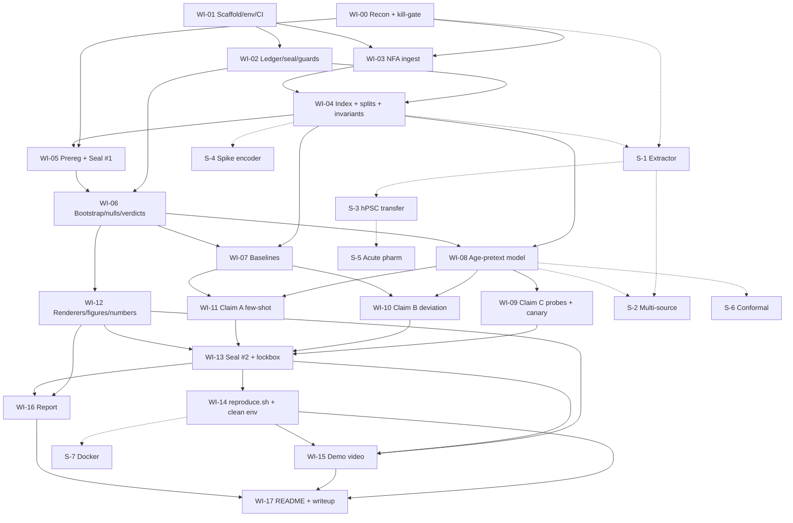

# Implementation Plan — Age-Pretext Encoder for Neural Organ-on-Chip Electrophysiology

Status: **DRAFT for review.** Nothing in this repo is implemented. Every module is a stub that
states its contract. Sections 15 (decisions) and 16 (assumptions) need your answers before
work item WI-05 (preregistration seal) can run.

Effort scale: **S** ≤ 2 h, **M** ≈ 4 h, **L** ≈ 8 h of focused solo work.
CP = on the critical path. DROP = can be dropped without breaking the minimum viable result.

---

## 1. Executive summary

**What gets built.** We train a small, cluster-bagged ensemble regressor that predicts culture age
(log days-in-vitro) from spontaneous MEA activity. It is trained only on solvent-control wells.
The model's 16-d penultimate layer is the representation. On top of it we build three
evaluations: a few-shot transfer engine (Claim A), an out-of-fold age-deviation readout for
chronically treated wells (Claim B), and identity probes with a power-calibrated positive
control (Claim C). The validation machinery is a deliverable in its own right, and the video
demonstrates it running: a preregistration file, sealed protocol hashes, a hash-chained
append-only results ledger, verdicts computed by code from pre-declared thresholds, and
cluster bootstrap with the culture prep as the unit. Everything runs on one CPU machine. One
entry script (`reproduce.sh`) rebuilds every headline number and figure from public downloads.

**What gets claimed (MVR).** All three claims are tested on the US EPA Network Formation Assay
(NFA) 2018 release. It is the only public dataset we found that has an age series and a
perturbation series in the same cultures: rat cortex, DIV 5/7/9/12, 18 independent culture
preps, 99 plates, about 150 compounds dosed chronically, solvent controls on every plate. The
ToxCast subset (12 preps) is the development set and is cross-fitted by prep. The NTP subset
(6 preps) is a sealed lockbox, opened once.
- A: the frozen embedding plus logistic regression, trained on k = 10 labelled wells, is
  non-inferior to the strongest from-scratch model trained on k = 50. The default downstream
  task is early cytotoxicity prediction (decision D3).
- B: out-of-fold age deviation separates treated wells from controls in a dose-dependent way,
  at non-cytotoxic concentrations, with prep-level cluster-bootstrap intervals. It is
  non-inferior to the best single raw-feature readout.
- C: a linear probe cannot decode plate identity within a culture prep (same cells, so
  differences there are pure acquisition artefact) beyond a permutation null. A synthetic
  canary shows the probe could detect a plate artefact of stated size if one existed.

**Single biggest risk.** NFA publishes 17 well-level summary features, not spike trains. So the
encoder that can reach Claim B is an MLP over hand-crafted features. Claims A and B may then
collapse onto the hand-crafted baseline: the encoder may add nothing over "mean firing rate
plus burst rate". The control medians make this plausible. Mean firing rate goes 0.35 → 1.85 Hz
and burst rate goes 0.12 → 4.6 per minute from DIV 5 to DIV 12. The plan does not hide this.
The baselines that would expose it are pre-declared as kill conditions. The stretch path (S-1,
S-2, S-4) upgrades the representation, but only if NFA spike lists turn up (recon question R3b)
or if you accept that Claim B stays feature-level.

**Blunt notes up front.**
1. "Foundation encoder" is not earned in the MVR. The pretext corpus is about 540 control
   wells × 4 timepoints from one lab. Call it an *age-pretext representation*. "Multi-source"
   becomes defensible only with stretch item S-2 (Potter + EPA ontogeny data through a
   validated canonical feature extractor).
2. The MVR is rat-only. The sponsor works on human organoids. That costs points on Problem
   Importance (30%). The only human data is Kapucu hPSC: about 4–5 plates, so it is
   qualitative only (S-3). I recommend S-3 as the first stretch item after S-1, ahead of the
   spike encoder.
3. Claim A is the weakest claim under every input choice. Its from-scratch competitor gets the
   same 17 features the encoder gets. If you must drop one claim to save time, drop A, not C.
4. A literal "probe fails" result is weak evidence unless the probe is shown to have power.
   About 6 control wells per plate is a small sample. Hence the canary (WI-09).

---

## 2. What the data forces: argument for restructuring before planning

The brief assumes one encoder trained on activity, with all three claims read off it. The public
data does not support that for raw or spike-level input:

| Need | Only source that has it | Form in which it is public |
|---|---|---|
| Wide age spread, many independent cultures | Potter/Wagenaar 2006 (30 dense + 22 sparse/small cultures, DIV 3–39) | spike times |
| Age series **and** perturbation series | EPA NFA 2018 (18 preps, DIV 5–12, chronic DIV 0–12 dosing) | **17 well-level features only** |
| Human cultures | Kapucu 2022 hPSC (≈4–5 plates) | raw HDF5 (2.3 TiB) + spike CSVs |

So Claim B, which needs age × perturbation × ≥10 independent cultures, can be credible only
on NFA. Unless NFA spike lists are found, the representation that supports B must live in
NFA's feature space. A spike-trained encoder cannot be applied to NFA. Learning a map from
features to spike embedding adds no information and would be theatre. It is rejected.

**Recommended structure (decision D1):**
- **MVR = feature path on NFA.** All three claims and all validation run on one dataset with 18
  preps. This is the smallest result that is coherent, credible and reaches Claim B with real
  culture-level statistics.
- **Stretch = representation upgrades evaluated against the MVR:**
  - S-1/S-2 bring Potter and EPA ontogeny spike data into the same 17-d space through one
    validated extractor. That gives a multi-source pretext and a cross-lab Claim C.
  - S-4 is a spike-train set encoder, judged head-to-head against features on Claim A/C
    within the spike corpora.
- If recon finds public NFA spike lists, S-4 moves into the MVR and the feature path becomes
  its baseline. That would be the better project. Recon question R3b exists to settle this.

If you reject this structure and want the spike encoder as the MVR, Claim B falls back to
Kapucu acute pharmacology. That is one plate per species, so a culture-level cluster bootstrap
is impossible. In my judgement that breaks the non-negotiable Claim C standard. I would not do it.

---

## 3. Pre-recon evidence (gathered while writing this plan)

These are facts I verified, not assumptions. WI-00 re-verifies them reproducibly and fills the gaps.

**EPA NFA 2018** — `https://pasteur.epa.gov/uploads/10.23719/1503191/`
- `NTP_TC_Analysis.zip`: 159,560,650 bytes (HTTP 200), 12,376 entries (mostly Hill-plot PDFs).
- `New TC/sourceData/AllCombined_ToxCast_20180923.csv`: 11,512 rows × 26 columns.
  - Columns: `date, Plate.SN, DIV, well, trt, dose, units` and then `meanfiringrate,
    burst.per.min, mean.isis, per.spikes.in.burst, mean.dur, mean.IBIs, nAE, nABE, ns.n,
    ns.peak.m, ns.durn.m, ns.percent.of.spikes.in.ns, ns.mean.insis, ns.durn.sd,
    ns.mean.spikes.in.ns, r, cv.time, cv.network, file.name`.
  - Mutual information is in a separate `*_MI_*.csv` with the same keys.
  - DIV ∈ {5, 7, 9, 12} only. 12 culture dates, 66 plates, 102 treatments, 363 control
    (dose = 0) wells. 2,800 wells have all 4 timepoints and 104 have 3.
- `New NTP/sourceData/ALL_NTP.csv`: 5,712 rows, same schema, DIV {5, 7, 9, 12}. 6 culture
  dates, 33 plates, 50 treatments, 180 control wells.
- `date` is the **culture (plating) date**. File names such as
  `ON_20160921_MW1159-40_05_00_000.h5` keep the date fixed while DIV changes. Spike files are
  referenced but **not included**.
- Burst and network-spike columns are NaN in 26–39% of rows. They are undefined when no
  bursts occur, so the missingness is informative and concentrated at early DIV.
- **Controls sit in column 2 (A2–F2) on almost every plate.** Position is therefore confounded
  with treatment for Claim B, and a position probe cannot be run on controls.
- Viability: `Toxcast_AB_full_20180923.csv` (1,052 compound-dose rows × 3 replicates) and
  `ALL_NTP_AB.csv` (494 rows), with matching LDH files. 134 + 43 compound-doses have mean
  AB < 0.7 (45 + 16 compounds).
- Licence: EPA ScienceHub licence (`https://pasteur.epa.gov/license/sciencehub-license.html`),
  text to be recorded in WI-00.

**Potter/Wagenaar 2006** — `https://potterlab.bme.gatech.edu/development-data/`
- Dense spontaneous: **30 cultures in 8 batches**, 527 daily recordings, DIV 3–39. Coverage
  per DIV ranges from 2 to 27 cultures and is thinnest at DIV 29–30 and 39. Sparse: 10
  cultures. Small: 12.
- Format: `.spk.txt.bz2` with `time_s channel` rows. One file probed was 690 KB compressed,
  so the dense set is roughly 350 MB compressed.
- Hardware: MCS 60-electrode 8×8 grid. *(Assumed from the paper; to be confirmed.)*
- Terms: "acknowledge our work … by citing this article". No formal data licence. Code is
  GPL-2. → **Do not redistribute. Download from the origin at runtime.**

**Kapucu et al. 2022** (Sci Data 9:120) — G-Node DOI `10.12751/g-node.wvr3jf`
- **CC BY 4.0.** 2.3 TiB as a ZIP. Axion 12-well (64 electrodes per well) and 48-well
  (16 electrodes per well), 12.5 kHz.
- hPSC: plates MEA1–5, DIV 3–77 twice weekly. Rat: MEA1–4, DIV 2–35.
- Pharmacology is **acute only, at maturity** (hPSC DIV 29, rat DIV 22): kainate, CNQX,
  D-AP5, GABA, gabazine, TTX.
- Derived `*_spikes.csv` files sit per plate. Per-file download from GIN is unverified (R6).

**EPA ontogeny / Cotterill 2016** — `github.com/sje30/EPAmeadev`
- Per-electrode spike times in Axion 48-well HDF5 (`allH5Files/`), DIV ≤ 12, from the same
  lab and protocol family as NFA. Terms: "free to use … cite". No formal licence.
- File count and treatment content not enumerated (R3c).

**MEA-NAP** is a MATLAB pipeline. A MATLAB licence breaks the reproducibility criterion, so we
cite it as a reference but do not depend on it. The canonical extractor (S-1) is Python,
reimplementing the EPA `meadq` definitions.

---

## 4. WI-00 — Data reconnaissance (CP, M, kill-gated)

**Purpose.** Answer six questions with evidence before any modelling design is final. The
output is `recon/RECON.md` plus machine-readable `recon/inventory.json`. Every number traces
to a script in `recon/` that runs from a clean environment.

**Discipline.** Recon may compute descriptive statistics only. The NFA prep-to-split
assignment (dev vs lockbox, fold IDs) is fixed **before** the first descriptive statistic,
by a committed seed applied to sorted prep IDs (see WI-04). Recon statistics are computed on
dev preps only. The lockbox (NTP) is opened for row counts and schema checks only, never for
feature distributions.

| # | Question | Method / evidence required | Pass criterion (for the MVR) |
|---|---|---|---|
| R1 | Which sources carry per-recording DIV? | Per source: field name, where it lives (filename, HDF5 attribute, table column), parse rate. | NFA: `DIV` column (verified). Potter: filename token. Kapucu: `/DataInfo/DIV`. EPAmeadev: filename `DIVnn`. Parse rate ≥ 99%. |
| R2 | Is the age and culture distribution non-trivial? | Per source: histogram of DIV × independent culture; preps; plates; wells per prep; timepoints per well. Descriptive check on dev controls: Spearman ρ(DIV, mean firing rate) and ρ(DIV, burst rate). | ≥ 10 independent preps with ≥ 3 DIV levels each. ρ ≥ 0.5 for at least one feature (age identifiable). NFA appears to pass: 18 preps × 4 DIV, rising medians. |
| R3 | Age series **and** perturbation series? | (a) NFA: confirm dose = 0 controls on every plate, the dosing schedule (DIV 0? re-dosing at media changes?), compound-to-plate-to-prep nesting, plate layout map. (b) **Search for public NFA spike lists**: EPA ScienceHub, CCTE Clowder (`clowder.edap-cluster.com`), the supplements of Shafer 2019 and Brown 2016, USEPA GitHub. (c) Does EPAmeadev contain treated plates with metadata? | (a) Confirmed for ≥ 10 preps. (b) and (c) are informational and decide whether S-4 can be promoted (D1). |
| R4 | A labelled downstream task distinct from age, same modality? | Candidates scored on label source, n positives, n preps with positives, independence from activity-derived labels, and a ceiling check. T1: early cytotoxicity (AB < 0.7 at DIV 12) from DIV 5/7 activity. T2: exposure detection for held-out compounds at top dose vs control. T3: NTP DNT-reference positive vs negative compound (if the designations are published). T4 (stretch): Potter plating density class. | ≥ 1 task with ≥ 30 positive compound-doses across ≥ 8 dev preps. T1 appears to pass (134 TC compound-doses with AB < 0.7). |
| R5 | Minimum download supporting all three claims? | Byte counts and checksums per file. | MVR: `NTP_TC_Analysis.zip` (160 MB) plus the 4 small xlsx files. Stretch: Potter dense (~350 MB), EPAmeadev (TBD), Kapucu `*_spikes.csv` only (TBD, never raw HDF5). |
| R6 | Licences and redistribution | Verbatim licence text per source, saved to `recon/licences/`. Redistribution decision per source. Can GIN serve single annexed files? | Each source tagged REDISTRIBUTE / CITE-ONLY-DOWNLOAD-AT-RUNTIME / UNUSABLE. |

Additional facts recon must pin down, because later items depend on them:
- **F1.** Mapping from AB/LDH replicate columns (`AB1..AB3`) to plates. If it is unmappable,
  T1 labels stay at the compound-dose level (acceptable, declared).
- **F2.** Control positions per plate (column 2 verified for most plates), and which column
  holds which concentration rank. This feeds the Claim B position-sensitivity analysis.
- **F3.** Whether `cv.time` and `cv.network` are among EPA's 17 endpoints or extras. This fixes
  the feature list in `configs/features/nfa17.yaml`.
- **F4.** Whether NTP compounds carry published DNT positive/negative reference labels (task T3).
- **F5.** Hardware per source: electrode count, layout, pitch.

**Outputs.** `recon/RECON.md` (answers R1–R6 and F1–F5 with evidence), `recon/inventory.json`,
`recon/licences/*`, `data/manifests/*.sha256`, `recon/figures/*` (DIV × culture heatmaps).

**Acceptance.** Every row of the R table has a pass/fail with evidence. `make recon` regenerates
RECON.md numbers from scratch. You sign off on the kill-gate verdict before WI-05.

### Kill-gate (declared now)

| Gate | Finding that triggers it | Consequence |
|---|---|---|
| **K1 — no pretext** | No source has ≥ 10 independent preps × ≥ 3 DIV levels, **or** on dev controls no activity feature has \|ρ(DIV, feature)\| ≥ 0.5. | Project non-viable as framed. Go to **Fallback F-B**. |
| **K2 — no Claim B** | NFA dosing is not chronic across the recorded DIVs, **or** < 10 preps have both controls and treated wells at ≥ 3 DIVs, **or** the NFA files are unavailable or unlicensable. | Claim B is impossible at culture-level rigour. Go to **Fallback F-A**. |
| **K3 — no Claim A task** | No R4 candidate meets ≥ 30 positives across ≥ 8 preps. | Drop Claim A from the headline and report it as "not testable on public data". Proceed with B + C. No project-level kill. |
| **K4 — legal** | NFA licence forbids derivative publication. | Same as K2. |

**Fallback F-A — "Age-pretext representation with falsifiable credibility" (Claims A + C, B
demoted).** Pretext on Potter dense/sparse/small through the canonical extractor (S-1 becomes
CP). Claim C uses batch identity within Potter: 8 batches, with dish-within-batch probes
mirroring plate-within-prep. Claim A uses plating density or batch-held-out tasks. B is
reported only as a qualitative acute pharmacology case study on Kapucu, explicitly labelled
n = 1 plate per species.

**Fallback F-B — "Do MEA representations encode the lab? A batch-artefact audit of public MEA
feature pipelines."** This is a pure Claim-C project. Run the plate-within-prep and
batch-within-lab identity probes, with canary power calibration, on hand-crafted feature sets
(EPA meadq-style, MEA-NAP-style metrics recomputed in Python) across NFA, Potter and Kapucu.
The validation infrastructure is the deliverable. It reuses WI-01, 02, 04, 06, 09, 12, 14–17
unchanged, so roughly 70% of MVR effort carries over.

---

## 5. Design decisions resolved

### 5.1 Input representation

| Option | Preprocessing cost | What the encoder can learn | Reaches Claim B? | Verdict |
|---|---|---|---|---|
| Raw voltage | Prohibitive (2.3 TiB, spike detection, artefacts). It also carries the amplifier noise floor, which *is* a plate fingerprint, so it is hostile to Claim C. | Most | No | Rejected |
| Spike times, event-based | Moderate | High | Only with NFA spike lists | Rejected for v1 (needs a transformer over events, over-built) |
| **Binned spike counts** per electrode (100 ms bins, 300 s windows) | Low | Burst structure, synchrony, topology proxies | Only with NFA spike lists | **Stretch S-4. Promoted if R3b finds spike lists.** |
| **Well-level network features** (NFA 17 endpoints + missingness mask) | Zero for NFA. One validated extractor for spike corpora. | Only what the features encode | **Yes** | **MVR primary** |

**Pick: well-level features (MVR). Fallback, or upgrade if spike lists exist: binned counts.**
The decisive factor is reachability of Claim B at 18-prep rigour, not representational power.

Preprocessing, specified so WI-03 is executable:
- log1p on rates and counts (`meanfiringrate, burst.per.min, ns.n, mean.dur, mean.IBIs,
  mean.isis, ns.*durn*, ns.mean.*`).
- logit with ε = 1e-3 on percentages (`per.spikes.in.burst, ns.percent.of.spikes.in.ns`, after
  dividing by 100).
- `nAE` and `nABE` divided by the electrode count, so they become fractions. This is
  geometry-proof for S-2.
- Every NaN-bearing feature gets a binary *undefined* indicator, and the value is imputed with
  the train-fold median.
- Standardise with **train-fold statistics only**. The fitted transform is part of the fold
  artefact and covered by the protocol hash.

### 5.2 Heterogeneous array geometry
- **MVR:** NFA is uniformly Axion 48-well with 16 electrodes, so there is no heterogeneity.
  Well-level aggregates are permutation-invariant by construction.
- **S-1/S-2 (features across MCS-60 and Axion-16):** count-dependent features become
  fractions. Network-spike detection uses a threshold *fraction* of active electrodes, not an
  absolute count. Per-electrode statistics are averaged over active electrodes, never summed.
  A geometry-control experiment checks this: subsample Potter 60-electrode recordings to 16
  random electrodes, recompute features, and report the feature-wise ICC between full and
  subsampled arrays. Features with ICC < 0.7 are dropped from cross-source models. The cut is
  pre-declared.
- **S-4 (spike encoder):**
  - Electrodes form an unordered set. A shared per-electrode temporal encoder feeds attention
    pooling (one PMA seed) plus mean and max pooling, which is permutation-invariant by
    construction and unit-tested.
  - **Electrode-subsampling augmentation:** each 60-electrode training window is randomly
    reduced to between 16 and 60 electrodes, so the encoder sees the Axion-16 regime in every
    batch.
  - Spatial layout is deliberately ignored in v1. The 4×4 and 8×8 grids have different
    pitches, and coordinates would let the model fingerprint hardware, the exact thing Claim C
    forbids. Electrode coordinates are a further ablation only.

### 5.3 Architecture (as small as the claims allow)
- **MVR model:** MLP with `[25 inputs (17 features + 8 undefined indicators)] → 64 → 64 →
  z ∈ ℝ¹⁶ → linear age head`. GELU, dropout 0.1, weight decay 1e-3, MSE on log-DIV. About
  6k parameters.
- **Why not ridge?** Maturation curves are sigmoidal and the undefined indicators interact
  with values. Claim A also needs a reusable embedding that is not just the input. Ridge is a
  pre-declared baseline. If ridge matches the MLP on held-out age MAE, we report that, and
  Claim A's feature-LR baseline will expose whether z adds anything.
- **Why 16-d?** Smaller than the input, so the probe comparison between z and the raw input is
  not won by dimensionality alone. Probes are also run on PCA-16 of the input, to match
  capacity.
- **S-4 model:** a per-electrode 1-D CNN (3 dilated conv layers, 32 channels, kernel 5,
  dilations 1, 4, 16, about 3 s receptive field at 100 ms bins), plus a population-rate
  channel, set pooling, z ∈ ℝ³², and an age head. About 50k parameters. Recording-level
  prediction is the mean over windows. Nothing bigger is justified at ≈ 50 cultures.

### 5.4 Age target and the species clock
- **Target: log(DIV).** Rat cortical activity changes fastest early (NFA medians at DIV 5 → 12
  rise roughly 5× in firing rate and 40× in burst rate) and plateaus around DIV 21–28.
  Regressing raw days lets the unidentifiable plateau dominate the loss. Log days compresses
  the plateau and roughly equalises residual scale. MAE is also reported in days.
- **Identifiable window.** Beyond the plateau, age is not identifiable from activity, and
  residuals there are noise, not biology. In S-2, a window is estimated on training preps only
  (the DIV range where the median of the hand-crafted features is still monotone in DIV) and
  pre-declared. Residuals outside it are never interpreted. NFA (DIV 5–12) lies entirely
  inside the steep phase.
- **Rat vs human.** Never share an age scale across species. Normalising within culture type
  needs a maturity anchor (for example, time to first network burst). That anchor is itself
  an activity readout, which makes the target circular, so it is rejected. The MVR is
  rat-only, so the confound is absent by design. In S-3, hPSC recordings get no regression
  target in days. We test (i) whether the rat-trained age axis orders hPSC recordings
  monotonically within plate (Spearman ρ, plate-level bootstrap), and (ii) whether an
  isotonic map fitted on one hPSC plate transfers to another. A species-specific head is
  allowed. A shared head is not.

### 5.5 Uncertainty
- **Epistemic, per well: cluster-bagged deep ensemble, M = 5.** Each member trains on a
  bootstrap resample of training *preps* (not wells) with its own seed. Spread across members
  then reflects culture-to-culture variability, which is the uncertainty that matters. The
  cost is 5 × about 30 s on CPU per fold.
- **Group effects (the Claim B deliverable): cluster bootstrap over preps,** B = 4,000,
  percentile intervals. The headline is the lower bound. For each resample we recompute the
  per-compound effect, the detection rate and the trajectory.
- **Quantile regression is rejected for the MVR.** NFA has 4 discrete age levels, so
  conditional quantiles are degenerate.
- **Stretch S-6:** grouped split-conformal per-well intervals (calibration on held-out control
  preps), giving per-well coverage guarantees under prep exchangeability. Effort S.

### 5.6 Splitting invariant

> **INVARIANT-1.** No culture prep contributes data to more than one of {train, val, test} within
> any split. Wells, plates and recordings inherit their prep's assignment. Normalisation
> statistics, imputation medians and hyperparameters are fit on train preps only.
>
> **INVARIANT-2.** Treated wells (dose > 0) never enter pretext training.
>
> **INVARIANT-3.** Lockbox preps are read only by an evaluation run whose protocol hash is
> sealed and whose working tree is clean. Every opening is recorded in the ledger.

**Hierarchy.** `source > prep (culture/plating date or batch) > plate/dish > well > recording
(well × DIV)`. The split unit is always **prep**. For Potter, prep means batch (8). Dish-level
splits there are a declared sensitivity analysis only (D4).

**Enforcement in code** (`src/agepretext/invariants.py`, `data/splits.py`):
1. The recording index is a typed table (`RecordingIndex`). `prep_id` is a non-null column
   validated at construction.
2. Splits are created only by `make_group_splits(index, unit="prep", …)`. It returns a frozen
   `SplitManifest`: prep IDs per partition, fold ID, seed and a sha256 of its canonical JSON.
   No function in the package accepts row indices to split on.
3. Every dataset constructor, trainer and evaluator takes a `SplitManifest` and calls
   `assert_group_disjoint(manifest, index)` before touching data. Normaliser `.fit()` takes a
   manifest and refuses non-train rows.
4. **Sole exception: identity probes (Claim C)**, which by definition need the same plates on
   both sides. They are reachable only through `SplitPurpose.IDENTITY_PROBE`. That purpose
   splits *by recording timepoint* within plate (train the probe on some DIVs, test on others,
   so the probe must find a persistent fingerprint). It can be constructed only inside
   `eval/claim_c_probe.py`, and the ledger records it. A test asserts that any other module
   requesting it raises an error.
5. Tests: (a) a well-level split raises `InvariantViolation`; (b) shared preps across
   partitions raise; (c) fitting the normaliser on test rows raises; (d) treated rows in a
   pretext dataset raise; (e) property test on random hierarchies: the union of partitions
   equals all preps and their pairwise intersection is empty.
6. CI runs these tests. `protocol seal` refuses to seal if any split manifest fails
   `assert_group_disjoint`.

**NFA split design (recommended, D2):**
- **Dev = TC** (12 preps), with 6-fold grouped cross-fitting (2 preps per fold). Every dev well
  gets out-of-fold predictions from a model that never saw its prep.
- **Lockbox = NTP** (6 preps). It is evaluated once, under Seal #2, by a model trained on all
  12 TC preps.
- Compounds are nested within preps (6 compounds per plate, replicate plates within a prep),
  so cross-fitting by prep also holds compounds out. Claim A's held-out-compound property
  comes for free.

---

## 6. Validation specification (summary; binding text in `PREREGISTRATION.md`)

- **Seal #1 (WI-05)**, before any model is trained. It covers `PREREGISTRATION.md`,
  `protocol/prereg.yaml` (machine-readable hypotheses, metrics, thresholds, baselines, nulls),
  split manifests, the feature list and the data manifest. Its hash is committed and tagged
  `seal-1-<hash8>`.
- **Per-run seal.** Every evaluation run computes `protocol_hash = sha256(canonical(prereg ∥
  configs ∥ split manifests ∥ data manifest ∥ git commit))`. It refuses to run if the tree is
  dirty or the prereg hash differs from Seal #1. The hash is written into the ledger row.
- **Seal #2 (WI-13).** Hyperparameters and code are frozen. Only then may the lockbox be opened.
- **Verdicts are computed, not judged.** `eval/verdicts.py` reads the thresholds from
  `prereg.yaml` and emits SUPPORTS, REFUTES or INCONCLUSIVE. I never type a verdict.
- **Ledger.** `ledger/results.jsonl` is append-only and hash-chained (each row stores the sha256
  of the previous row). It is guarded by a pre-commit hook and a CI check that the diff against
  `origin` is pure line additions and the chain verifies. Every run is recorded, including
  failed, refuting and exploratory runs. Schema: `ledger/SCHEMA.md`.

**Pre-declared baselines (minimum set, all mandatory):**

| ID | For | Baseline |
|---|---|---|
| BL-0 | age | Predict the train-fold mean of log-DIV. |
| BL-1 | age, B | Ridge on log1p(mean firing rate) and log1p(burst rate). |
| BL-2 | age, A | Ridge (age) or logistic regression (A) on all 25 preprocessed inputs. This is the "input contains everything" baseline. |
| BL-3 | A | Same MLP architecture, random init, trained end-to-end on k wells, at every k. |
| BL-4 | A, C | Frozen *random-init* encoder plus logistic regression. Tests whether pretext training, not the architecture, carries the effect. |
| BL-5 | B | Raw-feature treated-vs-control readout, no encoder. Per-feature within-plate deviation AUC over DIV (mirrors EPA's AUC endpoint). The best single feature, chosen on dev, is the comparator. |
| BL-6 | B | Multivariate raw readout. Mahalanobis distance of each treated well from its plate's control distribution (shrinkage covariance), AUC over DIV. |
| BL-7 | B | EPA's published hit calls / AUC (external reference only, not a competitor). |

**Kill conditions per claim (defaults, D5 to confirm).** Point estimates do not count. Every
interval is a prep-level cluster bootstrap (95%, percentile).

| Claim | Primary hypothesis | Kill condition (claim fails) |
|---|---|---|
| Age (prerequisite) | Out-of-fold R² on log-DIV for held-out preps > BL-0, and MAE ≤ BL-1 MAE. | R² lower bound ≤ 0.30, or MAE lower bound worse than BL-1 MAE + 10%. On kill: B is reported on the BL-1 age model instead, labelled as such. |
| A | AUROC(ours, k = 10) − max(BL-2, BL-3)(k = 50) > −0.02 (non-inferiority, 5× fewer labels). | Lower bound of that difference < −0.02. Ceiling rule: if BL-2 at k = 10 has AUROC ≥ 0.95, the task is uninformative and the pre-declared alternative task is used. This is not a kill. |
| B | (i) Calibration: held-out control mean Δ CI ∋ 0 and \|mean Δ\| < 0.10 log-days. (ii) Detection rate at 5% control-null false-positive rate, at the highest non-cytotoxic dose (AB ≥ 0.8), is non-inferior to BL-5 (margin 10 percentage points). (iii) Dose-monotonicity: median per-compound Spearman ρ(dose, Δ-AUC) < 0 among detected compounds. | (i) fails, or the lower bound of (detection_Δ − detection_BL5) < −0.10. If only (iii) fails, that is reported, and "dose-dependent" is dropped from the claim wording. |
| C | Plate-within-prep probe on z: excess balanced accuracy (observed − permutation-null mean) not significant (one-sided permutation p > 0.05) **and** point estimate < 0.10 **and** ≤ the same statistic on the input features (no amplification). | Any of the three conditions fails. **Validity gate:** the canary must be detected at the pre-declared effect size (0.5 SD plate offset, injected into inputs) with power ≥ 0.8. If it is not, Claim C is INCONCLUSIVE (underpowered), not "passed". |

---

## 7. Work items (dependency-ordered)

Machine-readable copy: `workitems.yaml`. Graph: §8.

### WI-00 — Data reconnaissance · **CP · M** — see §4.

### WI-01 — Repo scaffold, environment, CLI, CI · **CP · S** · deps: none (parallel with WI-00)
- **Purpose:** an installable package, a pinned environment and one CLI surface everything hangs off.
- **Inputs:** this skeleton.
- **Outputs:** `pyproject.toml`, `environment.yml`, `requirements.lock` (pip-tools,
  hash-pinned), the `agepretext` CLI (`recon | fetch | index | split | seal | train | eval |
  figures | report | demo | reproduce | ledger verify`), `.github/workflows/ci.yml`,
  pre-commit hooks.
- **Acceptance:** `conda env create -f environment.yml && pip install -e . && agepretext
  --help` works in a fresh container. CI runs the test suite (skips allowed for unimplemented
  items) on push. CPU-only torch wheel.

### WI-02 — Validation infrastructure · **CP · M** · deps: WI-01
- **Purpose:** ledger, protocol sealing and run guards, demonstrable on camera.
- **Outputs:** `validation/ledger.py` (append, verify chain, export CSV),
  `validation/protocol.py` (canonicalise, hash, seal, verify, tag), `validation/guards.py`
  (`require_clean_tree`, `require_sealed_protocol`, `lockbox_access`),
  `.pre-commit-config.yaml` with the ledger append-only hook, and the `ledger verify` CI step.
- **Acceptance:**
  - Editing or deleting any existing ledger line fails both the pre-commit hook and CI.
  - A run on a dirty tree aborts before loading data.
  - The same inputs give the same hash across two machines (canonical JSON: sorted keys,
    fixed float repr, LF line endings).
  - Unit tests cover chain tamper detection.

### WI-03 — NFA ingestion and harmonisation · **CP · S** · deps: WI-00, WI-01
- **Purpose:** turn the EPA CSVs into a tidy, typed, checksummed table.
- **Outputs:** `data/sources/nfa.py` → `data/processed/nfa_recordings.parquet`.
  - One row per (prep, plate, well, DIV).
  - Columns: the 17 endpoints (+ CV columns per F3), MI joined, undefined indicators, dose,
    compound, CASRN, the viability join (AB/LDH at the compound-dose level), plate layout
    (row, column), `is_control`, `subset ∈ {TC, NTP}`.
- **Acceptance:**
  - Row counts equal source counts (11,512 TC and 5,712 NTP).
  - MI join is lossless.
  - Each prep has controls at ≥ 3 DIVs.
  - Schema validated (pandera, or explicit asserts).
  - The "DEPRECATED" folders are never read (asserted).

### WI-04 — Recording index, culture hierarchy, split manifests · **CP · M** · deps: WI-02, WI-03
- **Purpose:** INVARIANT-1/2/3 made mechanical (§5.6).
- **Outputs:** `invariants.py`, `data/index.py`, `data/splits.py`, `splits/nfa_dev_cv6.json`,
  `splits/nfa_lockbox.json`, tests (a)–(e).
- **Acceptance:** all invariant tests pass. Manifests are deterministic from the seed. The
  lockbox manifest is created before WI-00's descriptive statistics run (recon calls
  `split` first).

### WI-05 — Preregistration and Seal #1 · **CP · S** · deps: WI-00 (gate passed), WI-04
- **Purpose:** fix every hypothesis, metric, threshold, baseline, null and kill condition
  before results exist.
- **Outputs:** final `PREREGISTRATION.md` and `protocol/prereg.yaml` (drafts in the repo now),
  `protocol/seals/seal-1.json`, git tag.
- **Acceptance:** your sign-off on D2–D6. `agepretext seal` succeeds. `prereg.yaml` validates
  against its schema. No trained-model artefact exists in the repo or ledger at seal time
  (asserted: the ledger has no claim rows).

### WI-06 — Statistics core · **CP · S** · deps: WI-02, WI-05
- **Purpose:** one implementation of cluster bootstrap, permutation nulls and verdicts, used
  by every claim.
- **Outputs:** `eval/bootstrap.py` (prep-level resampling, percentile CIs, paired differences),
  `eval/nulls.py` (within-prep label permutation, control-vs-control pseudo-treatment nulls),
  `eval/verdicts.py`.
- **Acceptance:** on synthetic data with a known effect, the CI covers the truth at ≈ 95%
  across 500 simulations (± 3%). A verdict is reproducible from ledger inputs alone.

### WI-07 — Baselines BL-0 … BL-6 · **CP · S** · deps: WI-04, WI-06
- **Outputs:** `eval/baselines.py`, ledger rows for every baseline on dev (exploratory phase).
- **Acceptance:** all baselines run under the cross-fit manifest. Results go to the ledger
  regardless of outcome.

### WI-08 — Age-pretext model · **CP · M** · deps: WI-04, WI-06
- **Purpose:** the representation.
- **Outputs:** `models/feature_mlp.py`, `models/ensemble.py`, `train/pretext.py`,
  `train/crossfit.py`. Out-of-fold predictions `artifacts/oof_age.parquet` with columns
  (recording_id, fold, member, ŷ, z[16]). Fold artefacts include the fitted normaliser.
- **Acceptance:**
  - Deterministic given seed (bitwise on CPU).
  - Each fold trains on control wells of train preps only (INVARIANT-2 test).
  - Age metrics with cluster CIs go to the ledger.
  - Full TC cross-fit with M = 5 runs in < 15 min on CPU.

### WI-09 — Claim C: identity probes + canary · **CP · M** · deps: WI-08, WI-06
- **Outputs:** `eval/claim_c_probe.py`.
  - **C-primary:** plate identity within prep, controls only. A multinomial logistic probe
    with nested-CV regularisation is trained on 3 DIVs and tested on the held-out DIV
    (leave-one-DIV-out). The statistic is excess balanced accuracy pooled over preps.
  - **C-secondary:** prep identity across preps, age-matched, reported with an amplification
    ratio (z vs inputs vs PCA-16 vs random-init encoder).
  - **C-canary:** inject a per-plate offset into the inputs at 0.25, 0.5 and 1.0 SD, rerun the
    full pipeline including retraining, and report probe power at each size.
  - Permutation null: 1,000 within-prep shuffles of plate labels.
- **Acceptance:** the outputs needed for video shot 3 exist (confusion matrices, null
  histogram with the observed value, canary power curve). Verdict computed.

### WI-10 — Claim B: age-deviation readout · **CP · M** · deps: WI-08, WI-07, WI-06
- **Outputs:** `eval/claim_b_deviation.py`.
  - Δ = ŷ − log DIV, out-of-fold, per well and DIV.
  - Within-plate effect E(compound, dose, DIV) = mean Δ(treated) − mean Δ(same-plate controls).
  - Δ-AUC over DIV per compound-dose.
  - Viability stratification (AB ≥ 0.8 is "non-cytotoxic").
  - Control-vs-control null at 5% false-positive rate.
  - Detection rate vs BL-5/BL-6.
  - Dose-response.
  - Position sensitivity (reference = lowest-dose wells instead of column-2 controls).
  - Trajectory export for shot 1.
- **Acceptance:** calibration check (i) is reported first. Every reported number carries a
  prep-level CI. Cytotoxic doses are reported separately, never pooled into the headline.

### WI-11 — Claim A: few-shot engine · **CP · M** · deps: WI-08, WI-07, WI-06
- **Outputs:** `eval/claim_a_fewshot.py`.
  - k ∈ {2, 5, 10, 20, 50, 100, all} labelled wells, class-balanced, drawn from train-fold
    preps only. 50 draws per k, tested on held-out-fold preps.
  - Ours = frozen z + logistic regression. Competitors BL-2, BL-3, BL-4 at **every** k.
  - Implemented as an incremental generator yielding (k, method, draw, metric) so the
    renderer can animate it live (shot 2).
- **Acceptance:** the curve with cluster CIs is reproduced. Ceiling rule evaluated. The
  primary non-inferiority test is computed by `verdicts.py`.

### WI-12 — Renderers: video shots, report figures, number macros · **CP · M** · deps: WI-06 (build against synthetic fixtures early); final run after WI-09–11
- **Outputs:**
  - `viz/trajectory.py` (shot 1), `viz/fewshot_curve.py` (shot 2), `viz/probe.py` (shot 3).
  - `viz/animate.py`: frame-sequence export to PNG plus MP4 via ffmpeg, 1920×1080, 30 fps,
    with a deterministic frame count.
  - `viz/figures.py`: a registry where every report figure is a function of ledger and
    artefact inputs.
  - `report_numbers.py` writes `report/generated/numbers.tex`, so every number in the report
    prose is a macro sourced from the ledger.
  - Specs per shot are in §10.
- **Acceptance:** `agepretext figures` regenerates every figure byte-identically from the
  artefacts (fixed fonts, `svg.hashsalt`). No figure is made by hand. Grep finds no literal
  results numbers in `report/sections/*.tex`, which a CI check enforces.

### WI-13 — Seal #2 and confirmatory lockbox run · **CP · S** · deps: WI-09, WI-10, WI-11, WI-12
- **Purpose:** freeze everything, then open NTP exactly once.
- **Outputs:** `seal-2`. Ledger rows tagged `phase=confirmatory`. Lockbox access logged.
- **Acceptance:**
  - The lockbox opening is a single ledger event.
  - Any later re-opening is visible as a second event with a different seal, which is
    allowed but must be disclosed in the report.
  - Headline numbers are generated from confirmatory rows only.

### WI-14 — Single entry script + clean-environment reproduction · **CP · S** · deps: WI-13
- **Outputs:** `reproduce.sh [--profile mvr|full|smoke]` covering fetch (checksummed), index,
  split, verify seals, train, eval (dev + lockbox), figures, numbers and report PDF.
  `make reproduce` is equivalent. A `smoke` profile runs in < 5 min on a 2% subsample for CI.
- **Acceptance:** in a fresh container, `bash reproduce.sh --profile mvr` reproduces every
  headline number in the report to the printed precision, and every figure byte-identically.
  Wall-clock < 1 h on 4 CPU cores. Run by CI on tag (smoke on push).
  **Note:** reproduction re-runs confirmatory evaluation under Seal #2. The ledger logs these
  as `phase=reproduction` rows, not as new lockbox openings.

### WI-15 — Demo video (≤ 5 min) · **CP · M** · deps: WI-12, WI-13, WI-14
- **Outputs:** `demo/STORYBOARD.md` (draft exists), `scripts/demo.py` (drives a live,
  narrated run: seal, train one fold live, ledger append, shots 1–3 rendering as the
  computation runs), screen capture, voice-over script, final MP4 ≤ 5:00.
- **Acceptance:** every on-screen number is produced live by the pipeline or read from the
  ledger. Runtime ≤ 5:00. Shots 1–3 present. A terminal shows `ledger verify` passing and the
  seal hash.

### WI-16 — Technical report (15–20 pp) · **CP · L** · deps: WI-12, WI-13
- **Outputs:** `report/main.tex` + `sections/`, built by `agepretext report`. Outline in
  `report/OUTLINE.md`. All figures and numbers are generated.
- **Acceptance:**
  - 15–20 pages.
  - Every claim states its prereg ID, verdict and lower bound.
  - Refuted and inconclusive results are reported with the same prominence as supported ones.
  - Limitations section names the single biggest risk outcome.

### WI-17 — README, Kaggle writeup, packaging · **CP · S** · deps: WI-14, WI-15, WI-16
- **Acceptance:**
  - README has a one-command quickstart, data and licence table, hardware, expected runtime,
    and how to verify the ledger and seals.
  - The Kaggle writeup is derived from the report abstract and figures.
  - The category is declared as Model & Algorithm.

### Stretch items (all DROP)

| ID | Item | Effort | Deps | Purpose and acceptance |
|---|---|---|---|---|
| **S-1** | Canonical spike→feature extractor (Python port of EPA `meadq` endpoints) | M–L | WI-00, WI-04 | Unlocks every non-NFA source. **Acceptance:** on EPAmeadev HDF5 files, recomputed endpoints match EPA's own published values with Spearman ≥ 0.9 per endpoint, and MAE is reported. Geometry ICC check (§5.2). |
| **S-2** | Multi-source pretext (Potter dense/sparse/small + EPAmeadev + NFA controls) | M | S-1, WI-08 | Earns the word "multi-source". Pre-declared ablation: does multi-source pretraining change NFA Claim A/B results vs NFA-only? Cross-lab C: leave-one-source-out age transfer within the overlapping DIV 5–12 window is pass/fail. Source identity probe is reported, not pass/fail, because hardware differences are real. |
| **S-3** | Human (hPSC) age-axis transfer, Kapucu spike CSVs | M | S-1 | Sponsor relevance. Within-plate Spearman of the rat age axis vs DIV on hPSC. Isotonic cross-plate transfer. Explicitly qualitative (≈ 4–5 plates). |
| **S-4** | Spike-train set encoder (binned counts) | L | WI-04, S-1 data loaders | The representation-learning upgrade. Head-to-head with features on Potter-internal Claim A (density task T4) and Claim C (dish-within-batch). Promoted to MVR only if R3b finds NFA spike lists. |
| **S-5** | Acute pharmacology before/after (Kapucu, within-recording sliding Δ) | S–M | S-3 | A literal "before/after drug" shot. n = 1 plate per species, labelled as a case study. |
| **S-6** | Grouped split-conformal per-well intervals | S | WI-08 | Per-well coverage on held-out control preps. |
| **S-7** | Docker image | S | WI-14 | Belt-and-braces reproducibility. |

Stretch priority: **S-1 → S-3 → S-2 → S-6 → S-4 → S-5 → S-7.** S-3 ranks above S-2 and S-4
because human relevance is worth more on the 30% Impact criterion than representational
sophistication is on the 30% Innovation criterion, given that the innovation story is already
carried by pretext + readout + falsifiable credibility.

---

## 8. Dependency graph



**Critical path:** WI-00 → WI-03 → WI-04 → WI-05 → WI-06 → WI-08 → {WI-09 ∥ WI-10 ∥ WI-11} →
WI-13 → WI-14 → WI-15 → WI-17, with WI-16 running in parallel from WI-13.
**Parallelisable:** WI-01 and WI-02 alongside WI-00. WI-12 against synthetic fixtures from
WI-06 onward. Report sections 1–3 (motivation, data, methods) can be drafted after WI-05.

**Budget.** MVR is 8 S + 9 M + 1 L ≈ **60 focused hours**. With AI-assisted implementation,
expect 4–6 calendar days solo. The video and report are about 20% of that and are the items
most often underestimated. **Pre-declared cut order if over budget:**
1. All stretch items.
2. Shot animations become static frames plus a live terminal.
3. Reduce BL-3 draws from 50 to 20 per k.
4. The report goes to 15 pages.

Do **not** cut WI-09's canary, the lockbox, or the ledger. Those are the distinguishing
contribution.

---

## 9. Minimum viable result vs stretch

**MVR = WI-00 … WI-17 on NFA.** It yields:
- An age model on held-out preps with CIs.
- Claim C: plate-within-prep probe with canary-calibrated power.
- Claim B: within-plate age-deviation trajectories with dose-response, viability
  stratification, and comparison to raw-feature readouts.
- Claim A: few-shot curve vs three from-scratch competitors at every k.
- Everything confirmed once on a sealed lockbox, with ledger and seals.

This is defensible even if A and B **refute**. A refuted, pre-registered B with a passing C is
still a credible submission. A "supported" B without C is not.

**Stretch = S-1 … S-7** (§7 table). Each is evaluated against the MVR, never instead of it.

---

## 10. Demo video: shots drive code requirements

Storyboard: `demo/STORYBOARD.md`. Each shot below lists what the code must render.

**Shot 1: age-deviation trajectory diverging under exposure** (`viz/trajectory.py`, WI-10 artefacts)
- X axis: DIV (5, 7, 9, 12). Y axis: Δ in days (log-days transformed back to "days
  younger/older at this DIV").
- A control band shows the median and the 95% prep-bootstrap interval of out-of-fold control Δ.
- One line per concentration of a chosen compound, sequential colour map by dose, with
  ensemble ± bootstrap ribbons.
- Animated reveal: DIV by DIV, then dose by dose.
- Requirements:
  - `render_trajectory(effects, compound, *, reveal_steps) -> list[Frame]`.
  - Compound selection is pre-declared in the storyboard by rule ("the NTP compound with the
    largest non-cytotoxic Δ-AUC lower bound"), never hand-picked after seeing plots.
  - Cytotoxic doses are drawn hatched.
  - An inset shows the BL-5 (raw firing rate) trajectory for the same compound.
- Honesty: NFA has no pre-exposure recording, because dosing starts at DIV 0. "Diverging"
  means divergence from controls growing over DIV 5 → 12. The narration says so.

**Shot 2: few-shot curve filling in live** (`viz/fewshot_curve.py`, consumes the WI-11 generator)
- X axis: labelled wells (log scale, k = 2 … all). Y axis: AUROC. Lines for ours, BL-2, BL-3
  and BL-4, with CI ribbons.
- Points appear as the generator yields them. The run is fast enough to film live for the
  dev fold, or replays recorded generator output at the same timing with an on-screen
  "replay" label.
- Requirements:
  - `LiveCurve.update(event)`.
  - `export_frames()`.
  - A horizontal guide marks "BL-best at k = 50", so the non-inferiority comparison is visible.

**Shot 3: batch-identity probe failing, next to a probe that succeeds** (`viz/probe.py`, WI-09 artefacts)
- Left: confusion matrix for plate identity within one prep, on z, which should look uniform.
- Middle: the same probe on canary-injected inputs, showing a clear diagonal. This proves the
  probe can see.
- Right: the permutation-null histogram with the observed excess accuracy marked, and the
  canary power curve.
- Requirements: `render_probe_panel(probe_results, canary_results) -> Frame` and a terminal
  overlay of `ledger verify` and the seal hash.

**Cross-cutting:** a 1920×1080 frame size, a fixed font bundled in repo (DejaVu Sans), a
colour-blind-safe palette, and every frame stamped with the protocol hash (first 8 chars) and
the ledger row ID it visualises.

---

## 11. Technical report: figures come from the pipeline

Outline and page budget: `report/OUTLINE.md`.
- LaTeX, built by `agepretext report` via latexmk.
- `report/generated/` holds `numbers.tex` and the figures. It is gitignored and rebuilt by
  `reproduce.sh`. A built PDF is attached to the release.
- Figure registry (`viz/figures.py`): F1 data and hierarchy overview, F2 age model
  calibration, F3 Claim C panel, F4 Claim B trajectories, F5 Claim B detection vs baselines,
  F6 Claim A curve, F7 validation workflow diagram (static, versioned), F8 ledger timeline.

---

## 12. Reproducibility design (from day one)

- **Data:**
  - Never committed.
  - `agepretext fetch` downloads from the origin and verifies sha256 against
    `data/manifests/*.sha256`, which is created in WI-00.
  - CITE-ONLY sources are never mirrored (D10).
- **Environment:**
  - `environment.yml` (conda, Python 3.11, ffmpeg, latexmk) plus hash-pinned
    `requirements.lock`.
  - CPU-only torch.
  - `torch.use_deterministic_algorithms(True)`, fixed seeds, single-threaded BLAS for
    bitwise-reproducible training.
- **One entry point:** `reproduce.sh`. Profiles in `configs/profiles/`.
- **Hardware assumption:** 4 cores, 16 GB RAM, 5 GB disk (MVR), 20 GB (full stretch). No GPU
  needed. If S-4 is pursued at scale, a GPU would cut wall-clock but is not required (§16, A6).

---

## 13. Where this is a precondition for the sponsor's digital-twin roadmap

A digital twin built on pooled neural data needs three things this project builds first:
1. **A shared state coordinate across sites and platforms.** Functional age is a unit-bearing,
   calibrated coordinate ("this chip behaves like DIV 9") that a twin can be conditioned on,
   compared against and initialised from. Without one, pooled recordings have no common axis.
2. **Proof that pooling does not encode the site (Claim C).** If representations carry plate or
   lab identity, a twin trained on pooled assets models the acquisition rig, not the biology.
   The plate-within-prep probe plus canary is the acceptance test any pooled neural data asset
   should pass before twin training. **This is the precondition** in the strict sense. The
   probe, canary and ledger tooling are reusable on the sponsor's own data unchanged.
3. **A perturbation readout in interpretable units (Claim B).** Twins must be validated
   against interventions. "Exposure makes the culture read 2.3 days younger, CI […]" is a
   validation target a twin can be scored on.

The report says this explicitly, and says what is missing: human data at scale (S-3 shows
only the method), 3D organoid geometry, and closed-loop stimulation data.

---

## 14. Repo skeleton

```
PLAN.md                    this document
PREREGISTRATION.md         DRAFT; frozen at Seal #1 (WI-05)
README.md                  quickstart (stubbed)
workitems.yaml             machine-readable work-item DAG
reproduce.sh               single entry point (stub)
Makefile                   thin aliases over the CLI
pyproject.toml, environment.yml
.pre-commit-config.yaml    ledger append-only hook
.github/workflows/ci.yml   tests + ledger verify + invariant tests
configs/
  data/{nfa,potter,epameadev,kapucu}.yaml
  features/nfa17.yaml
  model/{feature_mlp,set_encoder}.yaml
  train/pretext.yaml
  eval/{baselines,claim_a,claim_b,claim_c}.yaml
  profiles/{smoke,mvr,full}.yaml
protocol/
  prereg.yaml              machine-readable hypotheses/thresholds (DRAFT)
  seals/                   seal records (generated)
ledger/
  SCHEMA.md                row format + hash chain spec
  results.jsonl            append-only, empty until first run
splits/                    SplitManifest JSONs (generated in WI-04, committed)
data/manifests/            sha256 manifests (WI-00)
recon/RECON.md             WI-00 report template with questions R1–R6, F1–F5
demo/STORYBOARD.md         shot list, timings, narration skeleton
report/OUTLINE.md          section/page budget, figure registry
src/agepretext/
  cli.py config.py invariants.py
  data/{download,index,splits,windows}.py  data/sources/{nfa,potter,epameadev,kapucu}.py
  features/{canonical,bursts,network_spikes,harmonise}.py
  models/{feature_mlp,set_encoder,heads,ensemble}.py
  train/{pretext,crossfit}.py
  eval/{age,baselines,bootstrap,nulls,verdicts,claim_a_fewshot,claim_b_deviation,claim_c_probe}.py
  validation/{ledger,protocol,prereg,guards}.py
  viz/{style,trajectory,fewshot_curve,probe,animate,figures}.py
  report_numbers.py
scripts/demo.py
tests/                     invariant, ledger, protocol, split-leakage tests (stubs)
```

The ledger format is in `ledger/SCHEMA.md`. Config layout: one YAML per concern. A profile
composes them. The resolved config is canonicalised and hashed into the protocol hash.

---

## 15. Decisions you must make

| ID | Decision | My recommendation | Why I can't decide it |
|---|---|---|---|
| **D1** | Accept the restructure: MVR = NFA feature path, spike encoder as stretch (promoted only if NFA spike lists exist)? | Yes | It changes what "the encoder" means in your title and pitch. |
| **D2** | Lockbox design: TC = dev (cross-fit), NTP = sealed confirmatory set, opened once? Alternative: cross-fit all 18 preps with no lockbox (more power, weaker protection). | TC dev / NTP lockbox | Trade-off between power (6 lockbox preps make wide CIs) and protection. It's your methodology. |
| **D3** | Claim A downstream task: T1 early cytotoxicity (DIV 5/7 → AB < 0.7), T2 held-out-compound exposure detection, T3 DNT reference class (if F4 finds labels). Plus which one is the pre-declared alternative under the ceiling rule. | T1 primary, T2 alternative | T1 labels are compound-dose level (3 replicate plates). You may judge cytotoxicity too close to "activity collapse" to count as distinct. |
| **D4** | Cluster unit: NFA prep (culture date, 18 preps) vs plate (99). Potter batch (8) vs dish (52). | Prep and batch for splits and primary CIs. Plate and dish as declared sensitivity analyses. | "Culture" is ambiguous in your brief. Prep is stricter but gives few clusters, so the lockbox CIs will be wide. |
| **D5** | Numeric thresholds: age R² floor 0.30; A non-inferiority margin 0.02 AUROC at k = 10 vs 50; B margin 10 percentage points, calibration 0.10 log-days, non-cytotoxic AB ≥ 0.8; C excess-accuracy cap 0.10, permutation α 0.05, canary 0.5 SD at power 0.8. | As listed | These encode your risk tolerance and must match your existing methodology. |
| **D6** | Your existing validation infrastructure: do you have a ledger schema, hash recipe (what goes into the protocol hash) or seal format I must match, or code to vendor in? | Unknown | You said the plan should mirror a methodology you already use. I designed a compatible one from scratch, but I haven't seen yours. |
| **D7** | Hard calendar budget (days) and submission deadline. | n/a | Sets where the cut order bites. |
| **D8** | Hardware: CPU-only confirmed? Any GPU? RAM and disk? | CPU-only is sufficient for the MVR | Affects only S-4. |
| **D9** | Report language and template (English LaTeX? competition-mandated template?), and whether the Kaggle writeup has a word limit. | English LaTeX | Competition-specific. |
| **D10** | Redistribution: Potter and EPAmeadev have no formal licence ("cite"). Download at runtime only (fragile if the sites go down), or ask the authors for permission to mirror derived feature tables on Zenodo? | Runtime download now, author email in parallel | A legal and relationship call. |
| **D11** | Title: drop "foundation" (MVR is single-lab, ≈ 540 control wells)? | Yes, use "age-pretext encoder" | Your positioning. |
| **D12** | Stretch priority: S-3 (human relevance) before S-4 (spike encoder)? | Yes | Positioning versus the sponsor. |

---

## 16. Assumptions I made (flag for review)

- **A1.** NFA `date` is the plating/culture date and identifies an independent cell prep.
  Inferred from file names that keep the date fixed while DIV changes. WI-00 confirms.
- **A2.** `dose == 0` rows are solvent (DMSO) controls with the same vehicle concentration as
  treated wells.
- **A3.** NFA dosing is chronic from about DIV 0 through DIV 12, re-dosed at media changes,
  with no pre-exposure recording. This is from Shafer et al. 2019 / Brown et al. 2016 as I
  recall them, not yet verified against the paper text (WI-00, R3a).
- **A4.** The AB/LDH viability replicates (`AB1..3`) correspond to the 3 replicate plates per
  compound. If not mappable to wells, labels stay at compound-dose level.
- **A5.** NFA, Potter and EPAmeadev are all E18 rat cortex and biologically comparable.
  Culture density, media and substrate differ, and S-2 must treat source as a covariate.
- **A6.** One machine (4+ cores, 16 GB RAM, ≥ 20 GB free disk) with no GPU is enough for the
  MVR and all stretch items except possibly S-4 at full scale. Nothing in the plan needs a
  cluster.
- **A7.** The competition permits public third-party data with citation, and judges will run
  or inspect `reproduce.sh` but not require bundled data.
- **A8.** "Days, not weeks" means about 5 calendar days for the MVR. The 60-hour estimate
  assumes AI-assisted coding.
- **A9.** Python 3.11, PyTorch (CPU), scikit-learn, pandas, matplotlib, ffmpeg and latexmk
  are acceptable dependencies.
- **A10.** Controls in column 2 are a systematic layout choice across plates (seen for most
  plates). The position confound in Claim B is handled by a sensitivity analysis, not
  eliminated.
- **A11.** The 2018 NFA release is the only NFA data used. Later NFA screening in ToxCast
  invitrodb is concentration-response summaries only, with no per-well DIV data.
- **A12.** Kapucu `*_spikes.csv` files can be downloaded individually from GIN without pulling
  the 2.3 TiB archive. If not, S-3 and S-5 are dropped.
- **A13.** Pre-recon descriptive checks on TC dev controls (the DIV medians quoted in §1) do
  not compromise preregistration, because they are disclosed here and WI-04 fixes the lockbox
  before WI-00 formally reruns them.

---

## 17. Sources

- Kapucu F.E. et al. (2022) *Comparative microelectrode array data of the functional development
  of hPSC-derived and rat neuronal networks.* Sci Data 9:120.
  https://www.nature.com/articles/s41597-022-01242-4 · PMC: https://pmc.ncbi.nlm.nih.gov/articles/PMC8969177/
  · Data: https://doi.gin.g-node.org/10.12751/g-node.wvr3jf/
- Shafer T.J. et al. (2019) *Evaluation of Chemical Effects on Network Formation in Cortical Neurons
  Grown on Microelectrode Arrays.* Toxicol Sci 169(2):436. https://academic.oup.com/toxsci/article/169/2/436/5366708
  · Data: https://catalog.data.gov/dataset/data-for-evaluation-of-chemical-effects-on-network-formation-in-cortical-neurons-grown-on-
- Wagenaar D.A., Pine J., Potter S.M. (2006) *An extremely rich repertoire of bursting patterns during the
  development of cortical cultures.* BMC Neurosci 7:11. https://bmcneurosci.biomedcentral.com/articles/10.1186/1471-2202-7-11
  · Data: https://potterlab.bme.gatech.edu/development-data/html/daily.spont.dense.text.html
- Cotterill E. et al. (2016) *Characterization of Early Cortical Neural Network Development in Multiwell
  Microelectrode Array Plates.* J Biomol Screen 21:510. https://www.ncbi.nlm.nih.gov/pmc/articles/PMC4904353/
  · Data/code: https://github.com/sje30/EPAmeadev
- EPA ScienceHub licence: https://pasteur.epa.gov/license/sciencehub-license.html
