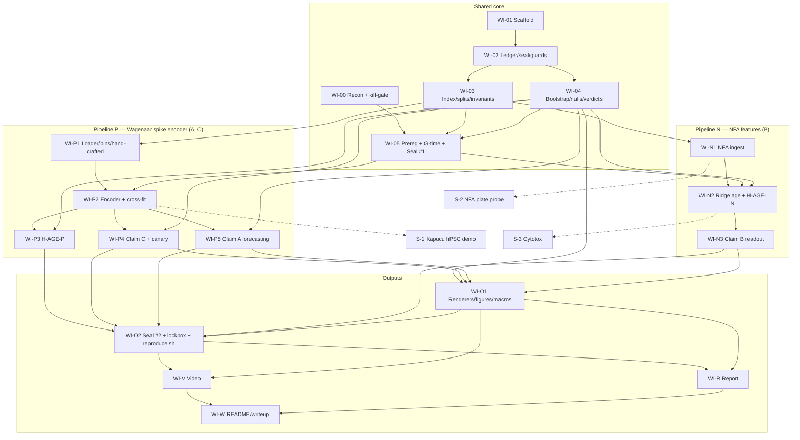

# Implementation Plan: Age-Pretext Encoder for Neural Organ-on-Chip Electrophysiology

**Version 2.** Revised after your answers to D1–D7 (decision log in §15). Nothing in this repo
is implemented. Every module is a stub whose docstring states its contract.

- Effort: **S** ≤ 2 h, **M** ≈ 3–4 h, **L** ≈ 8 h. Hour estimates are given per item because
  the budget is now hours-tight.
- **CP** = critical path. **CUT-n** = position in the pre-declared cut order (§9).
- Deadline **10 Oct 2026**. Budget **≈ 35 h**: 25.5 h engineering plus 10 h video and report,
  which is fixed.

---

## 1. Executive summary

**What gets built.** Two pipelines share one evaluation core: the age target, the
culture-prep splits and their invariants, cluster bootstrap, permutation nulls, the
relative-rule verdict engine, the ledger, protocol sealing and the renderers. They do **not**
share an input path.

- **Pipeline P (core), Wagenaar/Potter 2006.**
  - Model: a permutation-invariant electrode-set encoder over binned spike trains, trained to
    regress log days-in-vitro. This is the **age-pretext encoder**.
  - Data: 30 dense rat cortical cultures in 8 dissection batches, recorded daily from DIV 3
    to DIV 39.
  - Hosts Claim A and Claim C.
- **Pipeline N (core), EPA Network Formation Assay (NFA) 2018.**
  - A separate, deliberately simple age model (prep-bagged ridge) on the 17 published
    well-level features.
  - Hosts Claim B, the age-residual perturbation readout, at 18-prep rigour.
  - Framed as an **independent cross-corpus replication of the age-residual concept**. The
    encoder never sees NFA.
- **Kapucu 2022 hPSC.** Downloadable, but cannot meet the culture-prep standard (§2.2).
  Therefore it is the **first stretch item**: a labelled-qualitative human transfer
  demonstration.

**What gets claimed.** Each claim survives only under the relative rule (D5).
- **A (representation):** frozen age-pretext embedding plus a linear head, trained on k = 4
  labelled cultures, forecasts a held-out-batch culture's network-burst rate 7 days ahead. Its
  cluster-bootstrap conservative bound must beat the point estimate of the best pre-declared
  baseline trained on all available cultures (≈ 22, about 5.5× more). Baselines: hand-crafted
  current state (mean firing rate, burst rate, DIV), the same architecture from scratch, and a
  frozen random-init encoder. This follows your D3 fallback (§2.2). **Your confirmation is
  needed: D3′.**
- **B (readout):** in NFA, out-of-fold age deviation of chronically exposed wells separates
  them from same-plate controls. Its cluster-bootstrap lower bound on detection rate must beat
  the best pre-declared 1-D baseline readout: the mean-firing-rate + burst-rate age residual,
  or the best single raw feature. Development is on ToxCast (12 preps). It is confirmed once on
  the sealed NTP lockbox (6 preps).
- **C (credibility):** a synthetic batch artefact (canary) injected into spike trains is
  detected at the pre-declared power. Real dissection-batch identity is **not** detected by a
  linear probe on the encoder's embedding.

**Single biggest risk: Claim C may fail for a biological reason, not an artefactual one.**
Wagenaar et al. 2006's headline finding is that cultures develop *idiosyncratic, culture-specific
bursting repertoires*. Batch identity spans different embryos and dissection days, which is
real biology plus acquisition differences. A good activity encoder may legitimately decode it.
The probe design reduces this (age-matched, held-out cultures within batch, so only a shared
batch-level fingerprint can score). It cannot eliminate it. If C fails, the honest reading is
"batch is decodable; we cannot separate biology from artefact on this corpus", not "the
encoder memorises acquisition". The report must carry that sentence. See D13 for a cleaner
artefact-only probe I recommend adding as a secondary.

**Second risk: Claim B under D5.** A 1-D age projection must beat the mean-firing-rate +
burst-rate residual by more than the bootstrap interval. Control medians suggest age in NFA is
largely firing and burst rate (§3). A refutation is a live outcome and is pre-declared as one.

**Terminology.** "Age-pretext encoder" is used throughout. "Foundation" appears nowhere in code,
report or video. At 30 cultures and 8 batches it is not earned.

---

## 2. Structure by dataset role, and what the evidence did to D3

### 2.1 Roles (your D1, adopted)

| Corpus | Role | Input path | Claims | Independent units |
|---|---|---|---|---|
| Wagenaar/Potter 2006 (dense) | Age-pretext encoder corpus | spike times → 200 ms bins → set encoder | A, C (+ age prerequisite) | 8 batches (prep), 30 cultures (dish) |
| EPA NFA 2018 | Cross-corpus replication of the age-residual readout | 17 features → per-fold transforms → ridge | B | 18 preps (TC 12 dev, NTP 6 lockbox) |
| Kapucu 2022 | Human transfer demonstration | spike CSVs → same bins → frozen encoder | stretch (qualitative) | see §2.2 |

**Shared code:** `invariants`, `data/index`, `data/splits`, `eval/age`, `eval/bootstrap`,
`eval/nulls`, `eval/verdicts`, `validation/*`, `viz/style`, `viz/animate`, `report_numbers`.
**Not shared:** loaders, transforms, models, and the claim-specific evaluators.

### 2.2 Kapucu was verified today: usable data, unusable for a culture-prep claim

GIN folder listing plus one file downloaded (`hPSC_20517_MEA1_DIV28_spikes.csv`: 9,369,904 bytes,
601,688 rows, header `Channel,Time`, channel `<well>_<electrode>`):

| Species | Prep (culture date) | Plates | DIVs |
|---|---|---|---|
| hPSC | `20517` | MEA1 + MEA2 (6 wells each, 64 electrodes) | 19 timepoints, DIV 3–66 |
| hPSC | `171017` | MEA4 | DIV 21, 24, 28 only |
| hPSC | `21018` | MEA5 | DIV 70, 73, 77 only |
| rat | `190617` | MEA1 | DIV 2–35 (10 timepoints) |
| rat | `250417` / `31017` | MEA3 / MEA4 | 3 timepoints each, DIV 21–31 |

Notes:
- `hPSC_MEA1_PCA` is a DIV 21–28 subset of the same `20517` plate, not a new prep.
- Pharmacology plates (`*_MEA2/3_Pharmacology`) are acute, single-timepoint.

Consequences for D3 (few-shot hPSC age prediction) under your D4 (culture prep is the unit):
- **The entire hPSC age series is one prep.** Splitting by prep forces the labelled pool to be
  prep `20517` and the test set to be preps `171017` + `21018`.
- In that test set **each prep occupies a single 7-day age window** (≈ DIV 24 vs ≈ DIV 74).
  Age is perfectly confounded with prep identity. A model that "predicts age" there could be
  detecting prep differences.
- There are two test clusters, so a cluster bootstrap is impossible and the D5 rule cannot be
  evaluated.
- Splitting MEA1 vs MEA2 instead is a split *within* one prep, which is exactly what D4 says
  understates variance.

This is the situation your own D3 clause anticipates ("if Kapucu proves unusable, fall back to
held-out-culture forecasting within Wagenaar"). I have applied it.
- **Claim A primary is Wagenaar held-out-batch forecasting** (definition in §5.6).
- **Kapucu hPSC is stretch S-1**, reported as a non-inferential demonstration. It has two
  parts: a within-prep MEA1→MEA2 few-shot curve, labelled as within-prep; and early-vs-late
  ordering on the two other preps. No claim verdict is attached.
- **D3′ asks you to confirm.** If you would rather keep hPSC as Claim A and accept a
  non-inferential result, say so. The cost is the same.

---

## 3. Evidence base

The NFA and Potter facts are as in v1. The checks run today add the Kapucu layout above and the
Potter batch structure below. Everything below was observed directly, not assumed.

- **NFA:**
  - TC: 11,512 rows, 12 preps, 66 plates, 363 control wells.
  - NTP: 5,712 rows, 6 preps, 33 plates, 180 control wells.
  - DIV is 5/7/9/12 only. 17 endpoints plus MI.
  - Controls sit in column 2. No spike lists. Viability (AB/LDH) per compound-dose.
  - Control medians, DIV 5 → 12: mean firing rate 0.35 → 1.85 Hz; burst rate 0.12 → 4.6/min.
- **Potter:**
  - Dense: 30 cultures, 527 recordings, DIV 3–39, `.spk.txt.bz2` (`time_s channel`, about
    690 KB per file).
  - Cultures per batch: b1:5, b2:6, b3:6, b4:2, b5:3, b6:3, b7:2, b8:3.
  - Sparse (10) and small (12) cultures exist only in batches 5–7, so **density is confounded
    with batch**.
  - → MVR uses dense only. Sparse and small are stretch.
- **Kapucu:** §2.2. CC BY 4.0. Individual CSVs download over HTTPS from
  `gin.g-node.org/.../raw/master/...`. hPSC `20517` is about 38 files × ~9 MB ≈ 350 MB.

The A13 disclosure (pre-recon descriptive statistics) is extended to cover today's checks: Potter
index-level counts, Kapucu folder listing, and one hPSC file's size, header and line count. No
activity statistic was computed on Kapucu or Potter. **The disclosure is the genesis row of
`ledger/results.jsonl`** (per D2).

---

## 4. WI-00: Reconnaissance (CP, S, 2 h, kill-gated)

Most questions are now answered with evidence (§3). The remaining work makes the answers
reproducible and closes the gaps that gate the encoder.

| # | Question | Status | Remaining work |
|---|---|---|---|
| R1 | Which sources carry DIV? | NFA column; Potter filename; Kapucu filename (`_DIV28_`) | Parse-rate check on all files. |
| R2 | Is the age spread non-trivial? | Potter: 30 cultures × up to 27 DIVs. NFA: 18 preps × 4 DIVs. | DIV × culture heatmaps. Spearman ρ(DIV, mean firing rate) on **Potter train-designated batches only**, after `split` runs. |
| R3 | Age series × perturbation? | NFA only (chronic dosing). Kapucu acute only. | Confirm the NFA dosing schedule from Shafer 2019 methods. Search once more for NFA spike lists (informational). |
| R4 | Downstream task distinct from age? | Wagenaar 7-day-ahead burst-rate forecasting (D3′). Kapucu hPSC fails D4 (§2.2). | Count (t, t+7±1) recording pairs per culture. |
| R5 | Minimum download? | MVR: NFA zip (160 MB) + Potter dense (≈ 350 MB). Stretch: Kapucu hPSC CSVs (≈ 350 MB). | sha256 manifests. |
| R6 | Licences? | NFA: EPA ScienceHub. Potter: cite-only. Kapucu: CC BY 4.0. | Save verbatim licence texts. Potter and NFA are download-at-runtime only. |

**Kill-gate (evaluated at the end of WI-00, about hour 2):**

| Gate | Trigger | Consequence |
|---|---|---|
| **K1** encoder corpus | Fewer than 8 Potter dense batches parse with DIV, or any batch has fewer than 2 cultures with ≥ 5 DIVs | Pipeline P is non-viable. Go to **Fallback F-B** (artefact audit) with NFA B intact. |
| **K2** Claim B | NFA unavailable, unlicensable, or dosing not chronic across recorded DIVs | Drop B. A + C proceed. |
| **K3** Claim A task | Fewer than 3 (t, t+7±1) pairs per culture for at least 20 cultures | A switches to the pre-declared alternative: 7-day-ahead **mean firing rate** forecasting (same pipeline, a target that is always defined). |
| **G-time** | One full-size encoder fit on **synthetic** spike data takes more than 10 CPU-min | Apply the pre-declared slimming: bins 200 → 400 ms, epochs 40 → 25. Decided before Seal #1, so it is not data-dependent. |

**Fallback F-B (if K1 fires): "Do MEA representations encode the lab?"** A Claim-C-only audit,
using plate-within-prep and batch probes with canaries on hand-crafted feature sets across NFA
and Kapucu. It reuses all of the shared core.

---

## 5. Design decisions

### 5.1 Input representation
- **P: binned spike counts.** 200 ms bins, 120 s windows (600 bins), per electrode, plus a
  population-rate channel.
  - Raw voltage is rejected: it is unavailable for Potter and carries amplifier-noise
    fingerprints, which works against Claim C.
  - Event-based input is rejected: it is over-built for the scale.
  - 200 ms resolves network bursts, typically 100 ms to 1 s, and inter-burst intervals of
    seconds. 120 s windows hold several bursts from roughly DIV 7 onward.
  - Fallback: 400 ms bins (G-time).
- **N: the 17 NFA endpoints plus MI, with undefined-indicators.** This is the only form in
  which NFA exists. The v1 transforms are kept (log1p, logit on percentages, fractions of
  electrodes, train-fold median imputation and standardisation).

### 5.2 Geometry
- Potter is MCS, 59 recording electrodes per culture. Kapucu is Axion: 64 electrodes per well
  on 12-well plates, 16 per well on 48-well plates.
- The encoder treats electrodes as an unordered set: shared per-electrode CNN, then attention
  pooling (one seed) concatenated with mean and max pooling. Invariance to electrode
  permutation is unit-tested.
- Training augmentation subsamples each window to a random 16–59 electrodes, so the encoder is
  exercised on Axion-like counts.
- Electrode coordinates are not an input, because they would let the model fingerprint hardware.
- Noisy electrodes listed by the source are dropped, not zero-filled.

### 5.3 Architecture
- **P encoder:**
  - Per-electrode 1-D CNN: 3 layers, channels 16 → 32 → 32, kernel 5, dilations 1/4/16,
    receptive field about 17 s.
  - Then set pooling, z ∈ ℝ³², and a linear age head. About 12k parameters.
  - Recording prediction is the mean over windows. Training samples 2 windows per recording
    per epoch, 40 epochs, AdamW.
  - Compute estimate: about 1 GFLOP per window-step, about 1,000 windows per epoch, about
    10 s per epoch, so about 7 min per model on CPU.
  - The smallest thing that can see burst structure over electrodes. Nothing larger is
    justified at 30 cultures.
- **N model: ridge on 25 transformed inputs.** Only an age axis is needed, no representation
  claim. Ridge is the smallest adequate model and keeps B about the *readout*, not the model.
- **Uncertainty:** cluster-bagged ensembles, with members trained on bootstrap resamples of
  training **preps**.
  - P: M = 3 (CPU budget).
  - N: M = 5 (ridge is free).
  - Group-level intervals always come from the prep-level cluster bootstrap (B = 4,000).

### 5.4 Age target and species
- Target is **log(DIV)** for both pipelines, via shared code (`eval/age.py`), with one
  species-specific head per species. No shared age scale across species.
- MVR is rat-only, in both corpora. The species clock arises only in S-1 (hPSC). There the
  rat-trained axis is evaluated by within-plate rank correlation and isotonic recalibration,
  never by regressing days.
- Potter spans the plateau (beyond about DIV 25). Age error is reported per DIV bin
  (3–9, 10–16, 17–23, 24–39), so plateau unidentifiability is visible, not averaged away.

### 5.5 Splitting invariants and the clustering unit (D4)
- **Unit = culture prep.** NFA prep = culture date (18). Potter prep = dissection batch (8).
- **Plate-level** intervals (NFA plate, Potter dish) are reported alongside as sensitivity,
  never as headline.
- INVARIANT-1/2/3 and their enforcement are as in v1: typed `RecordingIndex`, `SplitManifest`
  as the only split mechanism, `assert_group_disjoint` on every constructor, the leakage test
  suite, and seal refusal.
- One new sanctioned exception: `SplitPurpose.IDENTITY_PROBE` for Potter splits **by culture
  within batch**. The probe is trained on some cultures of each batch and tested on held-out
  cultures of the same batches. It is reachable only from `eval/claim_c_probe.py`.
- **Potter cross-fitting:** 4 folds of 2 batches each. Every recording gets out-of-fold age
  predictions and embeddings. A final encoder is trained on all 8 batches for the Claim C
  primary probe (§5.7).
- **Potter has no lockbox.** With 8 batches, holding any out cripples development. Protection
  instead comes from **no hyperparameter tuning at all**. Every P hyperparameter is fixed in
  `configs/` and covered by Seal #1. Only the pre-declared G-time slimming can change them, and
  only before the seal. **NFA: TC dev, NTP lockbox** (D2).

### 5.6 Claim A task (D3′): held-out-batch forecasting within Wagenaar
- **Target:** log1p network-burst rate (per minute) of the same culture at DIV t′, where
  t′ − t ∈ [6, 8] days (nearest to 7), from the recording at DIV t.
  - Pairs are formed within culture only.
  - Network bursts use one fixed detector (§5.8), shared with the hand-crafted baselines.
- **Unit labelled = culture** (all its pairs). k ∈ {1, 2, 4, 8, all}. "All" is every culture
  in the fold's 6 training batches (about 22).
- 30 draws per k. Test = the fold's 2 held-out batches.
- **Every method receives DIV t as an input.** Skill therefore has to come from
  culture-specific state, not from the population trajectory.
  - **Ours:** [z_frozen, DIV] → ridge.
  - **BL-A1:** [log mean firing rate, log burst rate, DIV] → ridge. This is the hand-crafted
    current state, i.e. the persistence baseline.
  - **BL-A2:** same architecture from random init, trained end-to-end on the forecasting
    target with k cultures (fixed 40 epochs).
  - **BL-A3:** frozen random-init encoder + DIV → ridge.
  - **BL-A0:** DIV only, the population trajectory.
- Metric: MAE on the target, lower is better.
- **Primary comparison:** ours at k = 4 vs the best baseline at k = all.
- Why this counts as "a task the encoder never saw": the encoder is trained on age only,
  never on future activity, and it is evaluated on held-out batches.

### 5.7 Claim C design (D5)
- **Data:** Potter dense recordings, binned by age into the 4 DIV bins of §5.4. The probe runs
  within each bin, so age cannot carry batch information.
- **Representation:**
  - Primary: embeddings from the **final encoder trained on all 8 batches.** This is the
    in-sample case, where memorisation would show.
  - Secondary: out-of-fold embeddings.
  - Reported comparators: hand-crafted features, and a random-init encoder.
- **Probe:** multinomial logistic regression (inner-CV regularisation), labels = batch, under
  the culture-within-batch split.
  - Statistic: excess balanced accuracy over 1,000 permutations.
  - Permutations shuffle batch labels at **culture** level, preserving culture structure.
- **Canary:**
  - Per batch, a batch-specific random 10% of electrodes receive extra Poisson spikes at the
    corpus median per-electrode rate for that DIV bin. This is a realistic "noisy electrode"
    acquisition artefact.
  - Injected into the **training data**. The encoder is retrained end-to-end and the probe
    rerun.
  - 10 seeds. Power = the fraction of seeds where the probe detects batch (p < 0.05).
- **Pass (D5):** canary power ≥ 0.8 **and** real batch identity is not detected (permutation
  p ≥ 0.05). If canary power < 0.8, the result is INCONCLUSIVE (underpowered), never a pass.
- The design parameters (10% electrodes, median rate, 10 seeds, 0.8 power, α 0.05) are
  pre-declared design choices, not claim thresholds. They are the minimum D5 leaves to me. Flag
  them if they differ from your methodology.

### 5.8 Hand-crafted features for Potter baselines
- Mean firing rate: spikes / (active electrodes × duration).
- Network-burst rate: population spike count in 100 ms bins exceeding the larger of (a) 4 ×
  the recording's median bin count and (b) spikes on ≥ 25% of active electrodes. Consecutive
  supra-threshold bins merge into one burst.
- The rule is fixed in `configs/features/potter_handcrafted.yaml` before Seal #1 and never
  tuned on outcomes. These numbers define a measurement, not a claim threshold.

### 5.9 Claim B design (D5)
- Δ = ŷ − log DIV, out-of-fold (6-fold by prep on TC; final model on all TC → NTP).
- Within-plate effect E(c, d, t) = mean Δ(treated) − mean Δ(same-plate controls).
  Δ-AUC = area under E over DIV 5–12.
- **Non-cytotoxic is defined relative to controls, with no absolute cut-off:** compound-dose
  mean AB ≥ the 5th percentile of control-well AB in the same subset.
- **Detection:** threshold at the 5% false-positive rate of a control-vs-control
  pseudo-treatment null. Detection rate = fraction of compounds whose Δ-AUC at the highest
  non-cytotoxic dose exceeds it.
- **Gating comparators** are the 1-D readouts, all thresholded identically:
  - BL-B1: age residual from a mean-firing-rate + burst-rate ridge age model. Your
    pre-declared kill baseline.
  - BL-B2: best single raw-feature deviation, chosen on dev.
- **BL-B3 Mahalanobis (17-D omnibus) is reported, but I recommend it be non-gating (D14).**
  An omnibus anomaly detector will beat any 1-D projection on detection rate by construction.
  The claim is about an *interpretable* readout in units of days, so the fair contest is
  against other 1-D readouts.
- **Calibration gate:** held-out control mean Δ has a CI containing 0. This is a null check,
  not an absolute threshold.
- **Sensitivity analyses:** lowest-dose wells as the reference (column-2 position confound);
  plate-clustered intervals; cytotoxic doses reported separately.

---

## 6. Validation specification (binding text in `PREREGISTRATION.md`)

**Relative rule (D5).** A claim survives only if its cluster-bootstrap bound in the favourable
direction beats the **point estimate** of the best pre-declared baseline:
- Lower bound for higher-is-better metrics.
- Upper bound for error metrics.

No absolute thresholds anywhere in the claim verdicts.

| Hypothesis | Metric | Survives iff | Best-baseline set |
|---|---|---|---|
| H-AGE-P (prerequisite, Potter) | out-of-fold MAE log-DIV, held-out batches | UB(MAE_encoder) < min point MAE over baselines | BL-0 mean; BL-1 ridge(log mean firing rate, log burst rate) |
| H-AGE-N (prerequisite, NFA) | same, held-out preps | UB(MAE_ridge17) < min point MAE over baselines | BL-0; BL-1 |
| H-A | forecasting MAE, held-out batches | UB(MAE_ours@k=4) < min point MAE over {BL-A0, BL-A1, BL-A2, BL-A3}@k=all | as listed |
| H-B | detection rate at 5% control-null false-positive rate | LB(det_Δ) > max point det over {BL-B1, BL-B2}, **and** the calibration CI contains 0 | BL-B1, BL-B2 (BL-B3 reported; D14) |
| H-C | canary power; real-batch permutation p | power ≥ 0.8 **and** p ≥ 0.05; power < 0.8 → INCONCLUSIVE | n/a |

**Kill consequences:**
- If an H-AGE prerequisite fails, the dependent claims still run and are reported with that
  failure attached.
- If H-AGE-N fails, B uses the BL-1 age model, labelled as such.

**Mechanics (unchanged from v1):**
- Seal #1 before any training.
- Per-run protocol hash; refusal on a dirty tree.
- Seal #2 before the NTP lockbox.
- Hash-chained append-only ledger with every run recorded.
- Verdicts computed by `eval/verdicts.py` from `protocol/prereg.yaml`.
- The A13 disclosure is ledger row 1.

---

## 7. Work items (dependency-ordered, about 25.5 h engineering)

The full table is in `workitems.yaml`. "Done when" is the acceptance criterion.

### Shared core (7.5 h)

| ID | Item | h | Deps | Outputs | Done when |
|---|---|---|---|---|---|
| **WI-00** | Recon + kill-gate (§4) | 2.0 | — | `recon/RECON.md`, `inventory.json`, `data/manifests/*.sha256`, licences | K1–K3 evaluated with evidence. `make recon` regenerates the numbers. |
| **WI-01** | Scaffold, env, CLI, CI | 0.5 | — | lockfile, CLI entry, CI | Fresh-container install and `agepretext --help` work. |
| **WI-02** | Ledger, seal, guards | 1.5 | WI-01 | `validation/*`, pre-commit hook | Tamper, deletion and dirty-tree tests pass. The genesis A13 row verifies. |
| **WI-03** | Index, splits, invariants (both corpora) | 1.5 | WI-02 | `invariants.py`, `data/index.py`, `data/splits.py`, `splits/{potter_cv4,nfa_dev_cv6,nfa_lockbox}.json` | Invariant tests (a)–(f) pass. Manifests are deterministic. |
| **WI-04** | Stats core: cluster bootstrap, permutation, relative-rule verdicts | 1.5 | WI-02 | `eval/{bootstrap,nulls,verdicts}.py` | 95% ± 3% coverage on 500 synthetic simulations. Verdict rules reproduce the prereg table. |
| **WI-05** | Prereg finalisation + G-time check + Seal #1 | 0.5 | WI-00, WI-03, WI-04 | `seal-1` | No TBD placeholders. The timing run used synthetic data only. Seal created. |

### Pipeline P: Wagenaar/Potter (11 h)

| ID | Item | h | Deps | Outputs | Done when |
|---|---|---|---|---|---|
| **WI-P1** | Potter loader, binning, hand-crafted features | 2.0 | WI-03 | `data/sources/potter.py`, `data/windows.py`, `features/potter_handcrafted.py` | 527 recordings indexed. Bins match spike counts exactly. Burst detector unit-tested on synthetic bursts. |
| **WI-P2** | Set encoder + age training + 4-fold cross-fit + final model | 3.0 (+≈ 1.5 h background CPU) | WI-P1, WI-05 | `models/set_encoder.py`, `train/*`, `artifacts/potter/oof.parquet`, final encoder | Permutation-invariance test passes. Deterministic. Every recording gets an out-of-fold prediction and z. |
| **WI-P3** | H-AGE-P + BL-0/BL-1 | 0.5 | WI-P2, WI-04 | ledger rows | Per-DIV-bin errors, batch-clustered CIs, verdict. |
| **WI-P4** | Claim C probe + canary (10 retrains, background) | 2.5 (+≈ 1.2 h background CPU) | WI-P2, WI-04 | `artifacts/potter/claim_c/` | Shot-3 inputs exist. Verdict computed. Canary power curve. |
| **WI-P5** | Claim A forecasting engine + BL-A0–A3 at every k | 3.0 | WI-P2, WI-04 | `artifacts/potter/claim_a/`, event stream | Shot-2 generator works. Primary comparison verdict computed. |

### Pipeline N: NFA (4 h)

| ID | Item | h | Deps | Outputs | Done when |
|---|---|---|---|---|---|
| **WI-N1** | NFA ingestion + transforms | 1.0 | WI-03 | `data/sources/nfa.py`, `features/harmonise.py` | Row counts match the source. MI join lossless. DEPRECATED folders never read. |
| **WI-N2** | Ridge age model, 6-fold prep cross-fit + H-AGE-N | 0.5 | WI-N1, WI-04, WI-05 | `artifacts/nfa/oof.parquet` | Controls-only training asserted. Verdict computed. |
| **WI-N3** | Claim B readout, nulls, BL-B1–B3, sensitivity | 2.5 | WI-N2 | `artifacts/nfa/claim_b/` | Calibration reported first. Shot-1 trajectories exported. Plate-clustered intervals alongside. |

### Outputs (3 h engineering + 10 h fixed)

| ID | Item | h | Deps | Outputs | Done when |
|---|---|---|---|---|---|
| **WI-O1** | Renderers for the 3 shots, report figure registry, number macros | 2.0 | WI-04 (fixtures); final after WI-P4, WI-P5, WI-N3 | `viz/*`, `report/generated/` | Byte-identical regeneration. No literal numbers in report prose. |
| **WI-O2** | Seal #2, NTP lockbox run, `reproduce.sh` (smoke + mvr) | 1.0 | WI-P3, WI-P4, WI-P5, WI-N3, WI-O1 | `seal-2`, confirmatory ledger rows | One lockbox opening ledgered. `reproduce.sh --profile mvr` regenerates every headline number in a fresh container. |
| **WI-V** | Demo video ≤ 5:00 | 4.0 (fixed) | WI-O1, WI-O2 | `demo/final.mp4` | Shots 1–3 come from live pipeline output or ledger replay. `ledger verify` and seal shown. |
| **WI-R** | Report, 15–20 pp | 5.0 (fixed) | WI-O1, WI-O2 | `report/main.pdf` | Every claim states its verdict and bound. Refutations are reported with equal prominence. |
| **WI-W** | README + Kaggle writeup + packaging | 1.0 (fixed) | WI-V, WI-R | README, writeup | Category declared as Model & Algorithm. |

**Engineering total:** 7.5 + 11 + 4 + 3 = **25.5 h**, plus the **10 h** fixed block = **35.5 h**.
There is **no slack**. Background CPU (≈ 2.7 h) runs overnight and is not counted.

### Stretch (all droppable, in priority order)

| ID | Item | h | Deps |
|---|---|---|---|
| **S-1** | Kapucu hPSC transfer demonstration (§2.2). Also zero-shot age on Kapucu rat prep `190617` as a cross-lab check: same lab as the hPSC data, so a lab shift without a species shift. Non-inferential. | 2.0 | WI-P2 |
| **S-2** | NFA plate-within-prep identity probe on the 17 features (cleanest artefact-only probe in any corpus; see D13) | 1.0 | WI-N1, WI-04 |
| **S-3** | Cytotoxicity prediction on NFA (your D3 demotion) | 2.0 | WI-N2 |
| **S-4** | Canary at 3 magnitudes (power curve rather than a single point) | 0.5 (+ CPU) | WI-P4 |
| **S-5** | Potter sparse/small cultures added to pretext, with density as a covariate | 1.5 | WI-P2 |
| **S-6** | Grouped conformal per-recording intervals | 1.0 | WI-P2 |
| **S-7** | Docker image | 1.0 | WI-O2 |

---

## 8. Dependency graph

**Critical path:** WI-01 → WI-02 → WI-03 → WI-05 → WI-P1 → WI-P2 → WI-P5 → WI-O1 → WI-O2 →
WI-V/WI-R → WI-W. This is 0.5 + 1.5 + 1.5 + 0.5 + 2 + 3 + 3 + 2 + 1 + 10 ≈ 25 h of serial
work. **Pipeline N is entirely off the critical path.** It runs while encoder training and the
canary use the CPU.

**Schedule (today is 5 Oct):**

| Day | Work | Hours | Background CPU overnight |
|---|---|---|---|
| Mon 5 Oct | WI-00, 01, 02, 03, 04, 05 → Seal #1 | 7.5 | — |
| Tue 6 Oct | WI-P1, WI-P2 (start), WI-N1 | 6.0 | P2 cross-fit + final encoder |
| Wed 7 Oct | WI-P3, WI-P4 (start), WI-N2, WI-N3 | 6.0 | canary ×10 |
| Thu 8 Oct | WI-P4 (finish), WI-P5, WI-O1, WI-O2 → Seal #2, lockbox | 6.0 | reproduce.sh clean run |
| Fri 9 – Sat 10 Oct | WI-V, WI-R, WI-W | 10.0 | — |

**Checkpoint G-sched** (end of Wed 7 Oct): if more than 3 h behind, apply the cut order from
the top. The decision is recorded in the ledger as an infrastructure row.

---

## 9. Minimum viable result, the 35-hour variant, and cut order

**MVR = everything in §7 except stretch.** It yields:
- The age-pretext encoder with H-AGE-P.
- Claim C (batch probe + canary).
- Claim A (forecasting curve against four baselines at every k).
- Claim B on NFA, confirmed once on the sealed lockbox.
- Ledger, seals, the three video shots, the report and `reproduce.sh`.

It stays defensible if A or B refutes. It is not defensible without C's canary.

**Pre-declared cut order.** Apply strictly from the top. Each cut is recorded in the ledger.

| # | Cut | Saves | Cost to the submission |
|---|---|---|---|
| CUT-1 | All stretch items | — | Human transfer appears only as a limitation |
| CUT-2 | Animated shots → static frames + live terminal | 1.0 h | Weaker presentation (10%) |
| CUT-3 | Claim A k-grid {1, 2, 4, 8, all} → {2, 4, all}; draws 30 → 15 | 0.5 h | Coarser curve. Primary comparison intact. |
| CUT-4 | Potter ensemble M = 3 → 1 | CPU only | Lose per-recording epistemic spread. Cluster CIs unaffected. |
| CUT-5 | Claim B: drop BL-B3 Mahalanobis and dose-response. Keep calibration, BL-B1/B2, lowest-dose sensitivity and plate-clustered intervals. | 0.75 h | Less context for B |
| CUT-6 | NFA lockbox replaced by a 6-fold cross-fit over all 18 preps | 0.5 h | Loses confirmatory protection. Contradicts D2, so it needs your sign-off if reached. |
| CUT-7 | Drop Claim B entirely | ≈ 4 h | Pipeline N is independent. A + C survive untouched. |
| never | Canary, ledger and seals, cluster bootstrap, Claim C | — | These are the contribution |

I put B (CUT-7) ahead of A because B is structurally separable in your restructure. Dropping it
leaves the encoder story whole. Dropping A would leave an encoder with no representation
evidence. Override if you rank them differently.

---

## 10. Demo video: shots drive code requirements

See `demo/STORYBOARD.md` (updated).
1. **Age-deviation trajectory (NFA, Claim B)** via `viz/trajectory.py`.
   - Control band; dose lines revealed by DIV; BL-B1 inset; cytotoxic doses hatched.
   - The compound is chosen by a pre-declared rule (largest non-cytotoxic Δ-AUC lower bound on
     NTP).
   - Caption states that dosing starts at DIV 0, with no pre-exposure recording.
2. **Few-shot forecasting curve filling in (Potter, Claim A)** via `viz/fewshot_curve.py`, fed
   live by the `eval/claim_a_fewshot.py` generator.
   - A guide line marks the best baseline at k = all.
   - A verdict badge comes from `verdicts.py`.
3. **Probe fails, canary succeeds (Potter, Claim C)** via `viz/probe.py`.
   - Real-batch confusion matrix (should look uniform).
   - Canary-retrained confusion matrix (diagonal).
   - Permutation null with the observed value marked; canary power.

Every frame is stamped with the protocol hash and the ledger `row_id`.

---

## 11. Report

Outline in `report/OUTLINE.md`, updated for the two-pipeline structure. All figures come from
`viz/figures.py`, and all numbers from ledger-backed macros. 15–20 pages. Claim C comes first
among results.

## 12. Reproducibility
- `reproduce.sh --profile mvr`: fetch with checksums, index, verify splits and seals, train
  (P cross-fit + final; N cross-fit + final), evaluate (dev + lockbox as `phase=reproduction`),
  figures, report.
- Expected wall-clock about 2 h on 4 cores, dominated by encoder training and the canary.
- `--profile smoke` runs in under 5 min for CI.
- Data is never committed. Potter and NFA are downloaded from origin at runtime.

## 13. Sponsor digital-twin precondition
Unchanged in substance from v1:
- A calibrated age coordinate (the shared state axis).
- A credibility test any pooled neural-data asset must pass before twin training: the batch
  probe plus canary, reusable on the sponsor's data as-is.
- A perturbation readout in interpretable units.

The two-corpus structure strengthens the second point. The same age-residual readout is shown on
two independent corpora with different input modalities.

## 14. Repo skeleton
As in v1, with updated stubs and configs:
- `data/sources/potter.py` is core.
- New: `features/potter_handcrafted.py`, `models/ridge_age.py`,
  `configs/features/potter_handcrafted.yaml`, `configs/model/ridge_age.yaml`.
- Claim A and Claim C evaluators retargeted to Potter.

The ledger format is in `ledger/SCHEMA.md`, and the genesis A13 row is present.

---

## 15. Decision log and open decisions

| ID | Status | Resolution |
|---|---|---|
| D1 | **Adopted** | Structure by dataset role (§2.1) |
| D2 | **Adopted** | TC dev / NTP lockbox. A13 logged as ledger row 1. **D2b (confirm):** Potter has no lockbox; protection comes from zero hyperparameter tuning (§5.5). |
| D3 | **Conflict → resolved by your fallback clause, needs confirmation (D3′)** | hPSC can't meet D4 (§2.2). Claim A = Wagenaar held-out-batch forecasting (§5.6). Kapucu = S-1. Cytotoxicity = S-3. |
| D4 | **Adopted** | Prep is the unit. Plate/dish intervals as sensitivity only. |
| D5 | **Adopted** | Relative rule (§6). One application question remains, D14. |
| D7 | **Adopted** | 35.5 h plan, cut order in §9. **Open:** deadline time zone and hour? |
| D8 | **Open** (left blank) | Provisional: one CPU machine, ≥ 4 cores, 16 GB RAM, 10 GB disk. **I need the real core count.** The canary and cross-fit schedule assume about 2.7 h background CPU overnight. |
| D9 | **Open** (left blank) | Provisional: English, LaTeX, our own template. Is there a mandated template or page format, and a Kaggle word limit? |
| D10 | **Open** (left blank) | Provisional: download from origin at runtime, nothing mirrored. Potter and EPAmeadev have no formal licence. |
| D11 | **Adopted** | "Age-pretext encoder" throughout. |
| D12 | **Open** (left blank) | Provisional stretch priority: S-1 → S-2 → S-3 → S-4 → S-5 → S-6 → S-7. |
| **D13** | **New** | Claim C on dissection batch confounds biology with artefact (§1 risk). Keep batch as the gating probe (your D5) and add S-2, the NFA plate-within-prep probe, as a secondary artefact-only check? I recommend yes. It is 1 h and is the only probe in any corpus where the cells are literally identical. |
| **D14** | **New** | Should Claim B's gating baseline set include Mahalanobis (17-D omnibus)? I recommend no. Report it, but gate on 1-D readouts (§5.9), because an omnibus detector beats any 1-D projection on detection by construction. If you want it gating, B will almost certainly refute. |
| **D15** | **New** | Claim A primary comparison at k = 4 vs k = all (≈ 22 cultures, 5.5×). Your original spec said about 10 labelled units vs "many times more". With 30 cultures, k = 10 vs all would be only about 2×. Confirm k = 4. |

## 16. Assumptions (flag for review)

- **A1.** NFA `date` = plating date = independent prep. Inferred from file names.
- **A2.** NFA `dose == 0` = vehicle controls.
- **A3.** NFA dosing is chronic from about DIV 0. To be verified in WI-00 R3.
- **A5.** Potter batch = one dissection (independent prep). The culture-within-batch structure
  follows the `batch-culture-DIV` file naming.
- **A6.** CPU-only is sufficient: about 7 min per encoder fit (estimated, verified by G-time on
  synthetic data).
- **A7.** Kapucu date tokens (`20517`, `171017`, `21018`, …) are d.m.yy culture dates, so they
  are distinct preps. This was inferred from naming consistency with the paper's plate list;
  WI-00 checks it against `expLog.csv`.
- **A8.** Wagenaar recordings are about 30 min each, so roughly 15 windows of 120 s per
  recording. To be checked in WI-P1.
- **A9.** 7 ± 1-day recording pairs exist for most cultures, given near-daily recording. To be
  checked in K3.
- **A10.** The judges accept runtime downloads of cite-only data.
- **A13.** The pre-recon disclosure (counts, layout, medians; Potter index counts; one Kapucu
  file's size, header and line count; no model fit) does not compromise the seal. It is logged
  as ledger row 1.

## 17. Sources
- Kapucu et al. 2022, Sci Data 9:120. https://doi.gin.g-node.org/10.12751/g-node.wvr3jf/ · repo
  https://gin.g-node.org/NeuroGroup_TUNI/Comparative_MEA_dataset
- Shafer et al. 2019, Toxicol Sci 169:436. Data:
  https://catalog.data.gov/dataset/data-for-evaluation-of-chemical-effects-on-network-formation-in-cortical-neurons-grown-on-
- Wagenaar, Pine & Potter 2006, BMC Neurosci 7:11. Data:
  https://potterlab.bme.gatech.edu/development-data/html/daily.spont.dense.text.html
- Cotterill et al. 2016, J Biomol Screen 21:510. https://github.com/sje30/EPAmeadev
